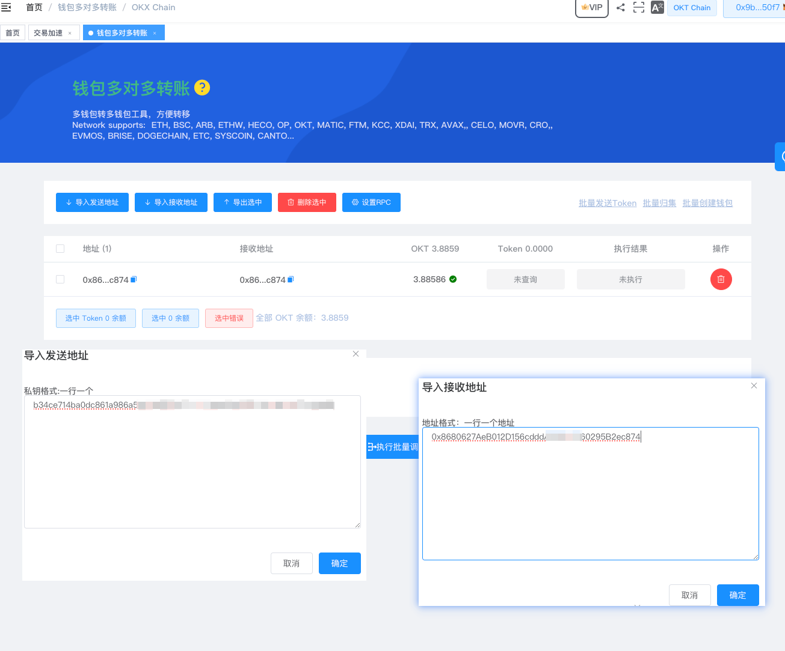
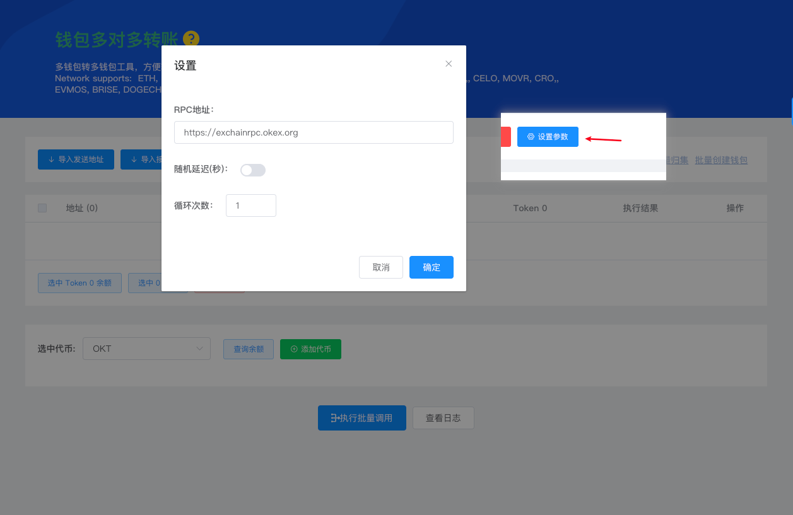
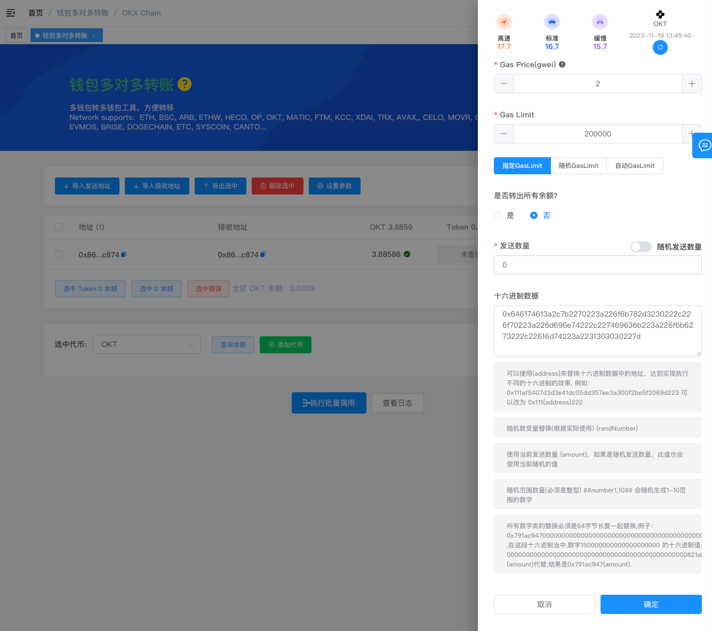
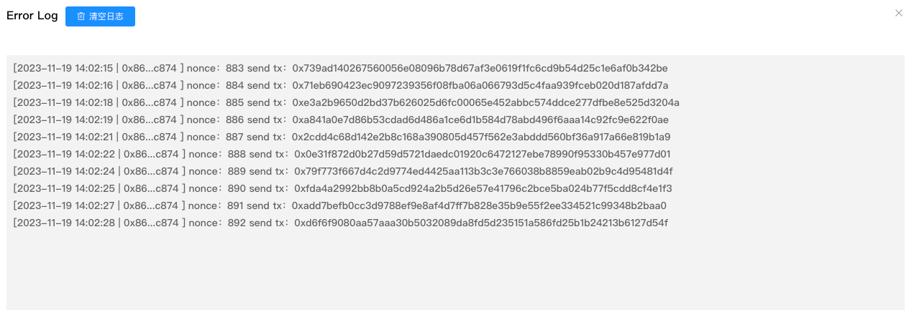

# 如何使用多对多转账Mint铭文

基于 EVM（Ethereum Virtual Machine）的区块链网络，例如Ethereum（ETH） Binance Smart Chain（BSC）、Polygon、Avalanche 等，通常 Mint 铭文原理都是通过自己给自己转账时在附加BRC-20标准的JSON格式。

```
例如：data:,{"p": "brc-20","op": "deploy","tick": "ordi","max": "21000000","lim": "1000"}
部署铭文

例如：data:,{"p":"okx-20","op":"mint","tick":"okbs","amt":"1000"}
在okx链进行Mint铭文

等等一系列操作，都是自己给自己转账是附加以上参数。
```


## 使用多对多转账Mint铭文


1. 导航到菜单功能中【[钱包多对多转账](https://tokentool.info/batchTransfer/okt)】功能 [https://tokentool.info/batchTransfer/okt](https://tokentool.info/batchTransfer/okt)

2. 导入发送地址私钥（**注意是私钥0x....格式，不是英文词**）
3. 导入接收地址(**注意：接收地址是发送的地址，这样就形成了自己个自己转账**)



4. 点击设置参数
   1. RPC地址：如有私人RPC地址可切换RPC地址，防止使用公共地址卡链。
   2. 随机延迟（秒）：每次执行一笔交易之后是否需要延迟等待。
   3. 循环次数：一个地址循环发送次数（根据gas手续费和自己要Mint操作调整）。



5. 选中地址点击【执行批量调用】操作

   1. 设置gas 汽油费用（注意gas 汽油的变化）、设置gas limit 、发送数量设置0

6. 设置16进制数据：例如（`data:,{"p":"okx-20","op":"mint","tick":"okbs","amt":"1000"}`）的十六进制参数：`0x646174613a2c7b2270223a226f6b782d3230222c226f70223a226d696e74222c227469636b223a226f6b6273222c22616d74223a2231303030227d`

   可通过 https://www.bejson.com/convert/ox2str/ 工具转换操作，注意前面0x需要保留。

7. 点击开始执行，将自动完成发送操作，
8. 
9. 




 可以点击查看日志按钮查看发送的交易Hash值。

