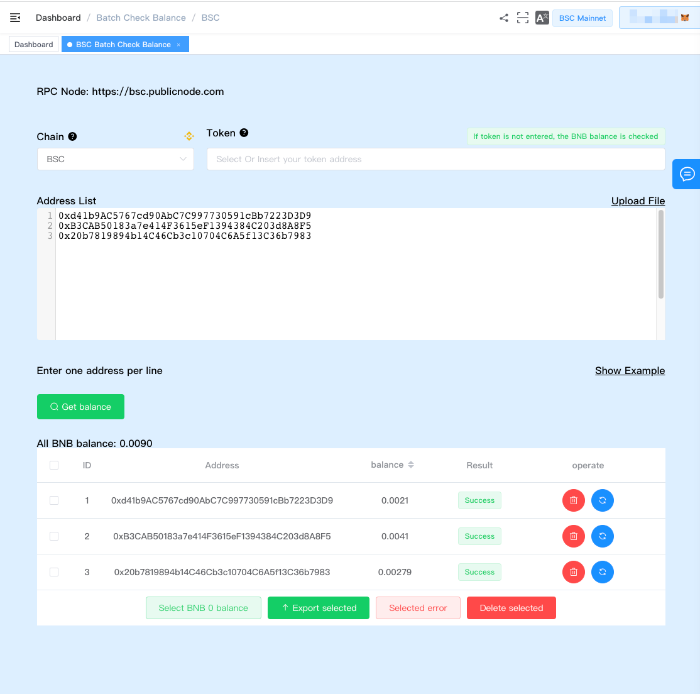
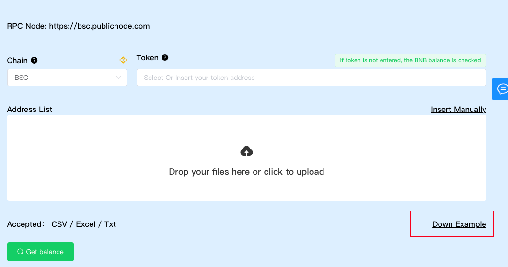
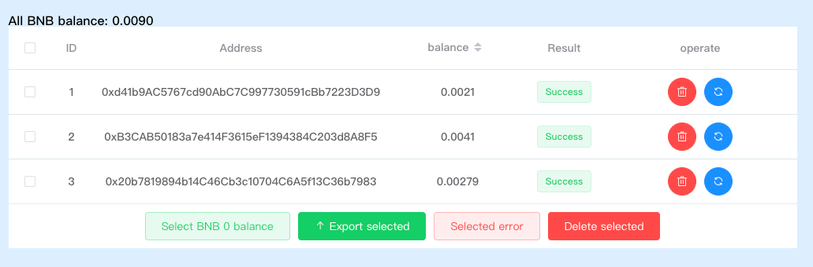

# 批量检测钱包余额

多链钱包地址余额批量检查功能允许用户一次性查询多种不同公链的多个钱包地址的余额信息。这种功能对于用户管理多个公链钱包中的加密资产余额或进行资产调查和监控是非常有用的。

#### 使用场景：

- **资产监控**：定期或实时监控多个钱包地址的余额信息，了解各个公链上的资产状况。
- **多链资产管理**：一次性查询多个链上地址的余额，方便进行资产整合和管理。

#### 操作步骤：

1. [导航到批量查询钱包余额菜单](https://tokentool.info/batchCheckBalance/eth)[https://tokentool.info/batchCheckBalance/eth](https://tokentool.info/batchCheckBalance/eth)
2. 粘贴要查询的ERC20标准代币合约地址，默认为空查询本链币余额。（如Ethereum链查询的是ETH余额）

4. 输入多个要查询的钱包，也可以通过 Upload File 上传xlsx 表格的方式批量上传。
6. 点击 查询余额 按钮进行批量查询钱包余额

