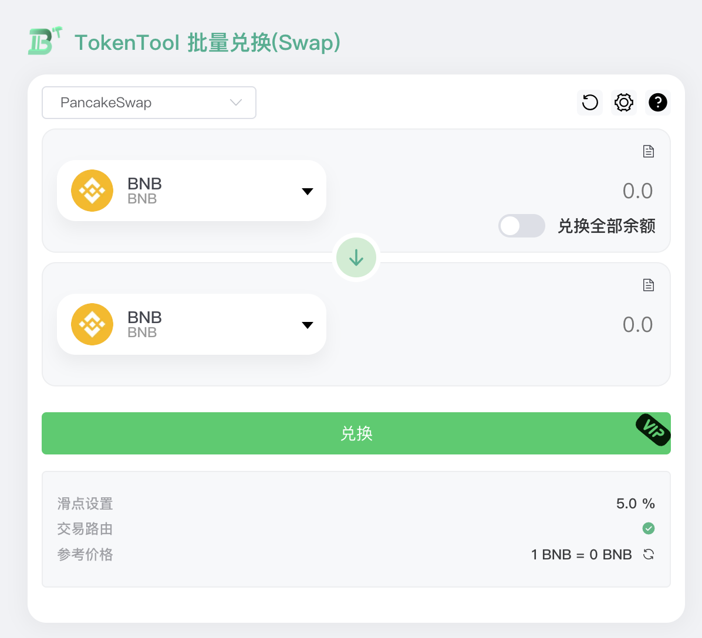
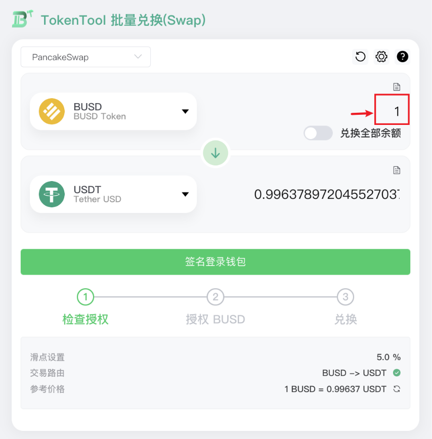
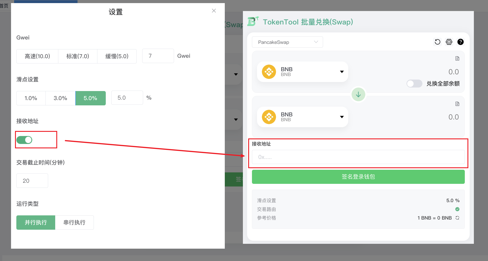
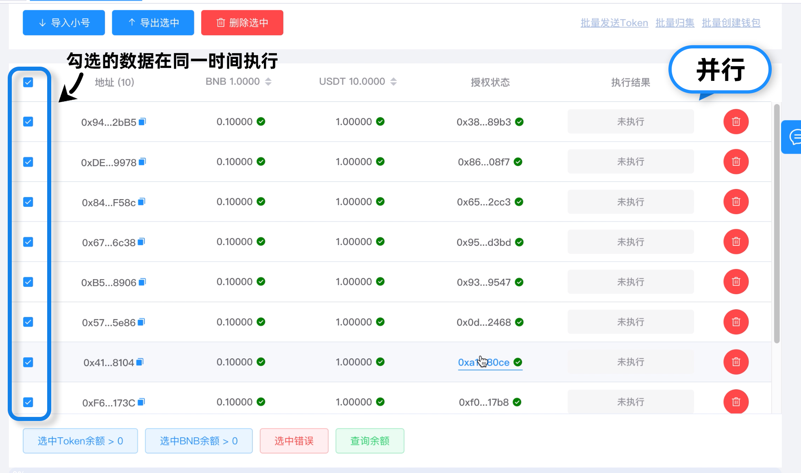
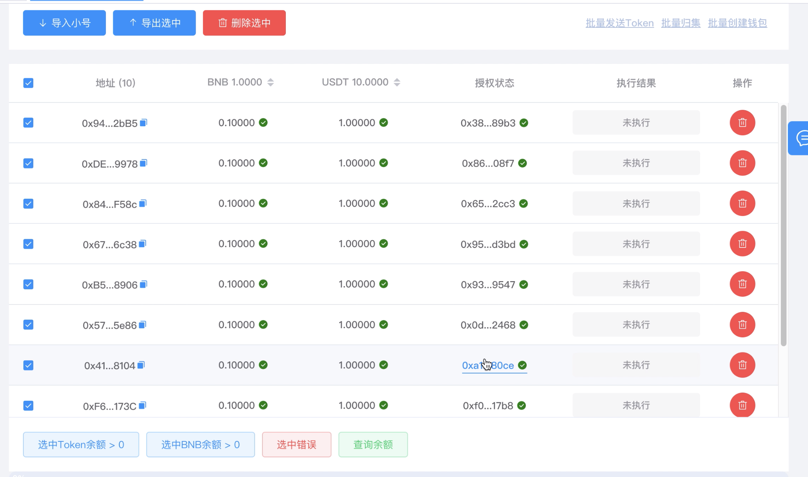
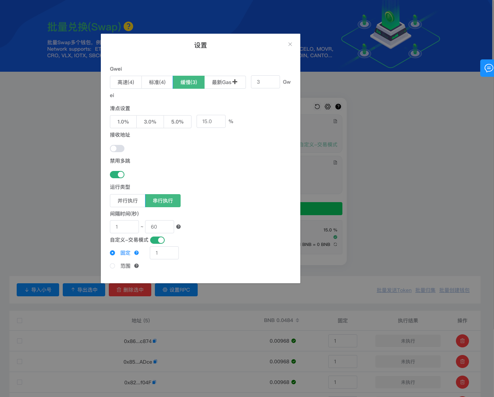

# 批量兑换(Swap)

与大多数交易所相比，在 TokenTool Swap 上进行交易非常容易。您不会被滑点所限制，所有计算都为您处理成最优的。

视频教程：[https://youtu.be/A7wKrW3k24I](https://youtu.be/A7wKrW3k24I)

### 开始交易

在进行交易之前，您需要一个兼容 Web3区块链交互的钱包。 您可以使用metamask 等钱包插件。 您还需要一些 BEP20 代币才能进行交易。

### 在TokenTool Swap批量兑换交易

1. [在这里进入兑换页面。](https://tokentool.info/batchSwap/bsc)[https://tokentool.info/batchSwap/bsc](https://tokentool.info/batchSwap/bsc)

2. 如果您还没链接钱包，在您的右上角点击链接钱包。也可以通过[快捷网络添加](https://tokentool.info/other/chainList)。快速的链接与区块链网络链接。

3. 从按钮部分的位置选择您要交易的代币，默认选择为BNB。

**注意：（如上图所示）我们将上方的代币称为token0，下方的代币称为token1，无论您选择哪种代币，都是将token0 兑换成 token1。不管您是买还是卖都将设置好代币的顺序。以免兑换失败！**

4. 如图所示，在选择您要交易的代币。接下来，通过输入框输点击，为您的**token0**代币输入1个金额。您的**token1**代币金额将自动估算，始终要记住通过token0=>token1的兑换顺序。

### 设置参数说明

##### Gwei煤气费

因此，首先要确保您有足够的BNB来支付链上的交易gas 费。通常gs fee 会根据链上打包的交易队列而波动，如果交易较多，则可能需要更高的 gas fee 才能推动交易。在这里可以了解更多关于[Gwei汽油费用的信息](https://academy.binance.com/en/glossary/gas)

##### 滑点设置

**BNB智能链上的代币在其合约中包含交易费**的情况并不少见，通常这些费用可用于燃烧，或进入项目方的营销钱包地址。
滑点将是对于一笔交易接收数量的容忍度，我们可以接受损失多少的代币数量，例如图中 1USDT兑换成 0.996378....BUSD ，如滑点设置百分之**50%**。代表本次交易能容忍接受丢失百分之 **50%** 的代币，如果设置为1%，在交易发生时，丢失的代币数量大于超过1%那将会提示矿工回滚本次交易兑换操作。

##### 接收地址

您可以在交易对兑时设置一个固定的接收地址，批量兑换时可将token1的代币自动归集到接收地址，可节省在次归集。

##### 交易截止时间

交易上链打包等待的容忍时间，如Gwei 燃气费用突然飙升，您的交易可能在链上一直属于padding状态无法打包成功。

##### 运行类型（模式）

**并行执行：** 所有选中的地址将会在同一时间发起兑换交易，这样往往会出现所有的交易都在一个区块同时完成

**串行执行：** 所有选中的地址会有序的进行交易，将按照从上往下的顺序一条条执行。

**串行间隔时间：** 

1. 在串行模式下，每一个地址买入完成后，间隔停留等待一定时间在进行执行下一个地址。
2. 输入相同的2个值代表等待固定时间。

**自定义交易模式：** 

1. 固定：选择自定义交易模式后，列表页面将会多出一列固定数量，根据固定金额买入。
2. 范围：列表页面将会多出一列范围输入框，范围表示根据地址的余额进行随机一个范围比例，（如输入：50～60）钱包地址中有1个BNB，将会随机0.5～0.6的BNB进行买入。

---

**温馨提示：** 如果您想让自己的代币有正确的图标logo 可通过[以下链接](https://forms.gle/ZipsociVg2KPHRLd6)申请上头像logo。

[https://forms.gle/ZipsociVg2KPHRLd6](https://forms.gle/ZipsociVg2KPHRLd6)

---

> 引用地址：
>
> [https://tokentool.info/batchSwap/bsc](https://tokentool.info/batchSwap/bsc) 批量Swap兑换
> 
> [https://tokentool.info/oneToMore/bsc](https://tokentool.info/oneToMore/bsc) 批量发送代币
> 
> [https://tokentool.info/batchCollection/bsc](https://tokentool.info/batchCollection/bsc) 批量归集代币
> 
> [https://tokentool.info/createWallet/bsc](https://tokentool.info/createWallet/bsc) 批量创建钱包
> 
>  [https://youtu.be/A7wKrW3k24I](https://youtu.be/A7wKrW3k24I) 视频教程
