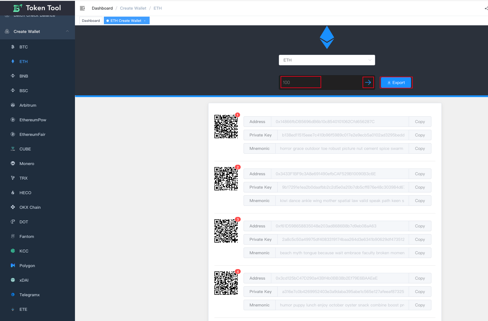

# 批量生成钱包

批量生成多链钱包地址功能允许用户一次性生成多种不同公链的钱包地址。这种功能对于用户管理多个公链资产或创建多个钱包账户来存储不同链上的资产是非常有用的。

#### 使用场景：

- **多链管理**：管理来自不同公链的加密资产，例如 BTC、ETH、BNB、TRX、DOT 等。
- **多账户需求**：为多个链创建钱包地址，以便于隔离和管理不同链上的资产。

#### 操作步骤：

1. **批量生成钱包**：确定要生成钱包地址的目标公链，例如 BTC、ETH、BNB、TRX、DOT 等，选择不同菜单对应的公链。
2. **输入数量**：输入想要生成多少地址数量后点击箭头开始执行生成钱包地址。
3. **导出保存地址**：通过【Export】按钮将生成的多个地址以及私钥，助记词导出存储在安全的地方，确保备份以便日后使用。

#### 注意事项：
- **建议打开平台网页后断开网络进行生成地址操作**
- **生成后的地址建议离线保存**

