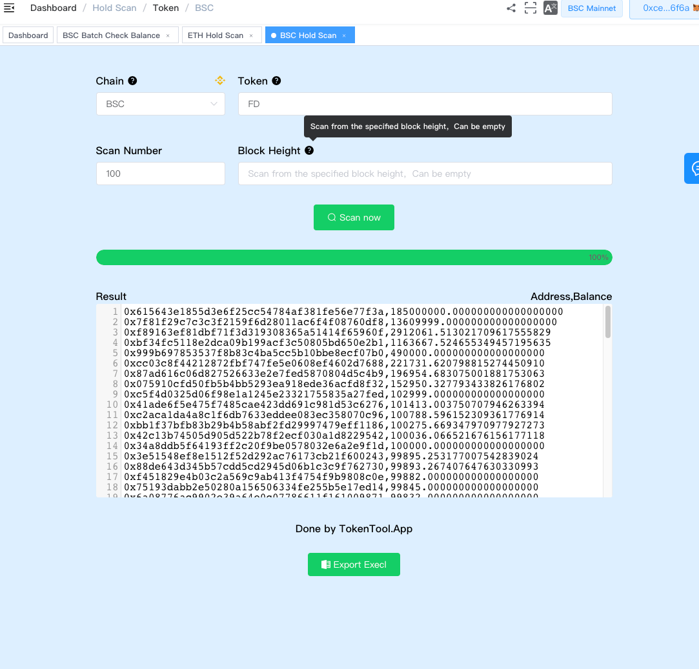
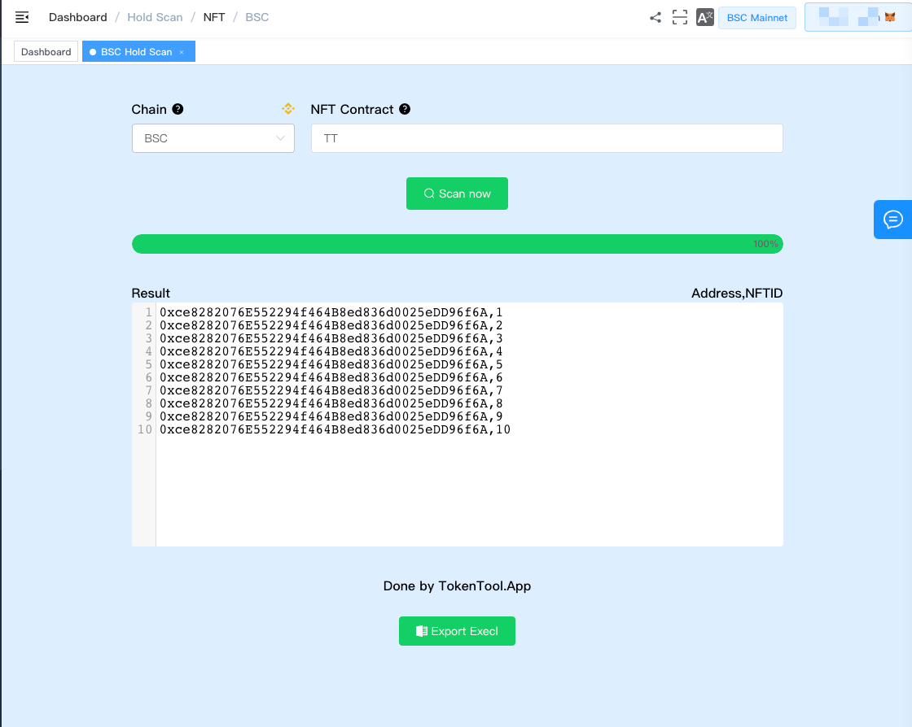

# Token/NFT持有人扫描

Token/NFT持有人扫描功能是一个便捷的工具，允许用户针对指定的ERC20代币合约地址或NFT合约地址，按需查询特定区块号下的持有人信息。用户可指定扫描的持有人数量，从而了解在指定区块中拥有该代币或NFT的用户数量和分布情况。

#### 使用场景：

- **持有人调查**：查询指定ERC20代币或NFT在特定区块中的持有人数量和持有分布情况。
- **数据分析**：了解在指定区块高度下，特定代币或NFT的持有人情况，以进行数据分析和市场调查。

#### Token主要功能：

- **输入ERC20合约地址**：用户可输入要查询的ERC20代币合约地址。
- **扫描数量**：用户可设定希望扫描的持有人数量，以获取特定数量的持有人信息，持币人地址从多到少排序。
- **固定区块号查询**：用户可以输入特定的区块号，获取该区块下代币或NFT的持有人信息。

#### Token持有人扫描：

1. 粘贴ERC20合约代币地址。
2. 指定扫描数量
3. 定制区块高度扫描，如为空按最新区块计算。
4. 点击Export按钮，导出Excel 表格文件。

#### NFT持有人扫描：

1. 粘贴ERC721标准的NFT合约地址。
2. 点击查询按钮。
3. 点击Export按钮，导出Excel 表格文件。

