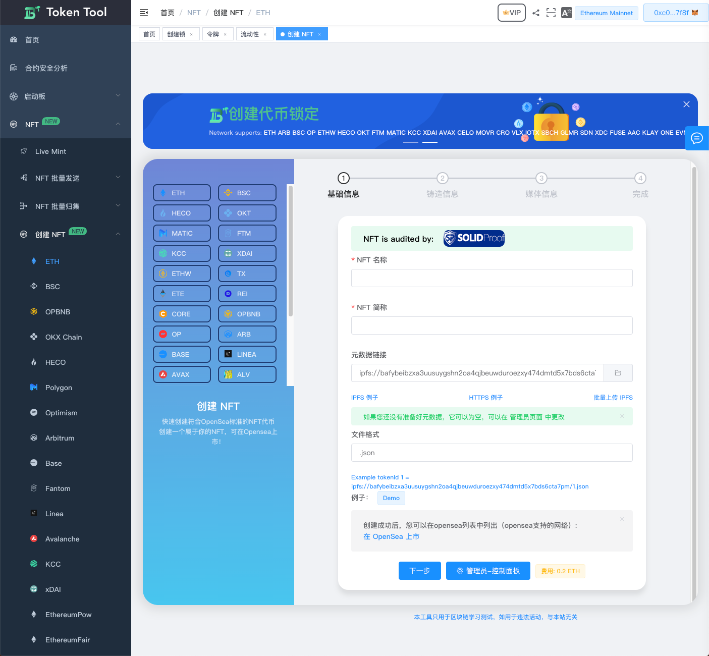
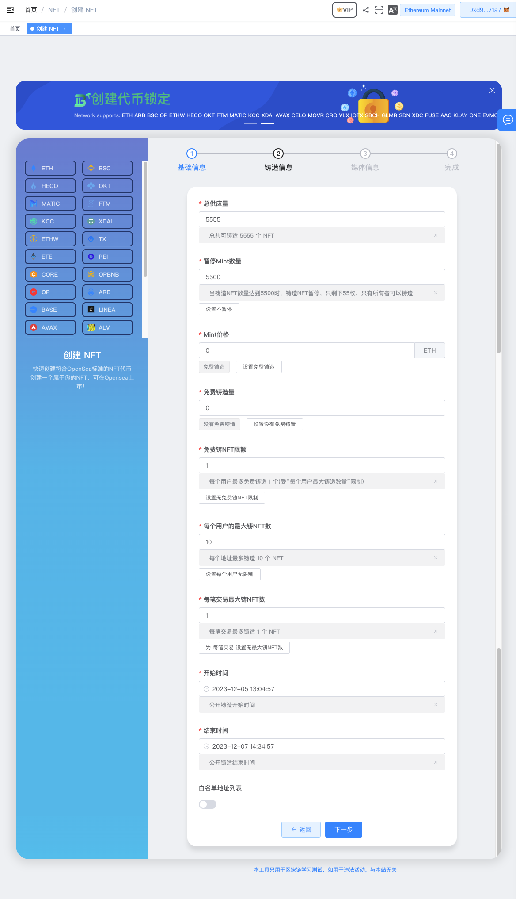
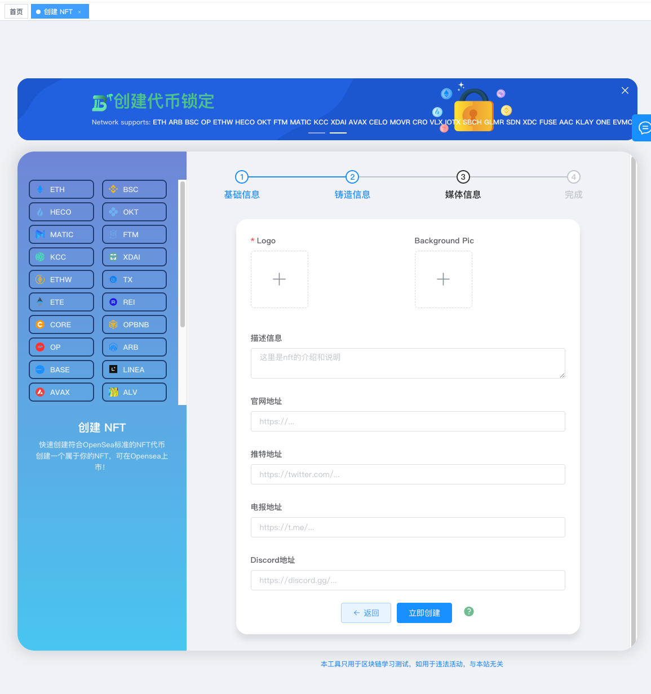
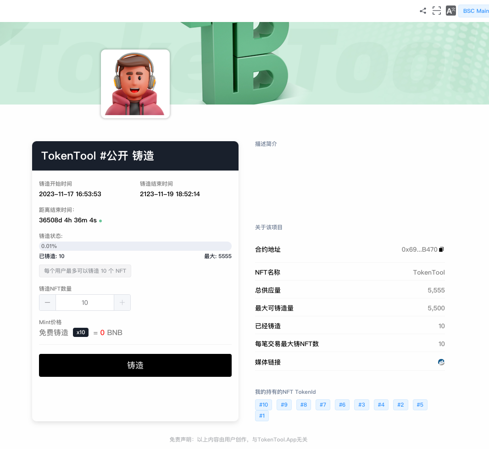
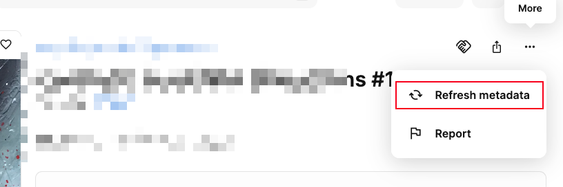

# 创建ERC721标准NFT

> **TokenTool是一个区块链工具箱，支持ETH、BSC、等超多公链。**

> **点击加入 [TokenTool官方交流群](https://t.me/tokentool_app) 交流反馈**

> **推荐使用电脑版谷歌浏览器 + `Metamask` 插件钱包 进行操作.**
> **手机用户也可以在 `钱包APP`-发现-输入官网链接 进行操作.**

> **视频教程链接： [https://youtu.be/JjYyoErrFw8](https://youtu.be/JjYyoErrFw8)**


### 功能说明

```

通过一键创建NFT可视化页面，简单配置输入信息，即可创建ERC721标准的NFT。
1. 需要准备好NFT图片，png,jpg或gif、mp3、mp4 等艺术品信息。
2. 需要通过IPFS系统上传文件信息，并且生成JSON原数据（metadata）
3. 通过可视化页面配置NFT信息，并创建。
4. 通过Mint-NFT页面完成Mint操作。

```

## NFT基本信息



1. 使用MetaMask/或其他Web3插件钱包进行连接网络。
2. 打开创建NFT菜单功能页面 [https://tokentool.info/nft/createNft/eth](https://tokentool.info/nft/createNft/eth)
3. **NFT名称** ：代表NFT的名称信息（例如 CryptoPunks）
4. **NFT简称** ：代表NFT的简称（例如 WPUNKS）
5. **元数据链接** ：元数据链接是指一个指向NFT相关信息的链接或URI。它在NFT创建时被赋予，通常指向存储在IPFS（或其他去中心化存储）上的元数据文件。（关于更多元数据制作，可查看[元数据制作教程](https://docs.tokentool.info/common-problem/generate-metadata))
6. **文件格式**：元数据文件后缀格式，（通常后缀使用.json格式）


## NFT铸造信息


1. **总供应量**：总共可铸造 多少 个 NFT的总量。
1. **暂停Mint数量**：当铸造NFT数量达到多少时，铸造NFT动作将进行暂停操作，设置0为不暂停操作。（例如：输入5500数量，当铸造NFT数量达到5500时，暂停铸造NFT，只剩下55枚，只有所有者可以铸造）
1. **Mint价格**：一个NFT的单价，价格只能是链币，设置0为免费铸造。（例如币安智能链BSC是BNB代币，以太坊链是ETH代币）
1. **免费铸造量**：免费铸造量，代表总NFT张数，有多少张NFT是免费。（如例子假设设置10，总供应量5555，其中10个NFT是免费的，还有5545张NFT是收费，根据Mint价格收费，如Mint价格设置0，则也代表是免费）。
1. **免费铸NFT限额**：每个用户最多免费铸造 多少张NFT，(受“每个用户最大铸造数量”限制)，（如果“免费铸造量”已经超过则没有免费额度，按照Mint价格计算收费）。
1. **每个用户的最大铸NFT数**：每个地址最多可以铸造多少个 NFT（如设置10，代表每个地址最多铸造10个NFT）。
1. **每笔交易最大铸NFT数**： 每笔交易最多铸造 多少 个 NFT。
1. **开始时间/结束时间**：铸造NFT在开始和结束时间内进行铸造NFT操作。
1. **白名单地址列表**：开启白名单后，只有白名单有资格的地址才能进行铸造NFT。

⚠️**注意：以上参数（除总供应量外）都可通过[NFT管理员](https://tokentool.info/nft/nftAdmin)控制面板重新修改。**


## NFT媒体信息


1. 媒体信息用于在NFT铸造页面显示。
2. **logo/背景图片**：使用[IPFS文件系统](https://tokentool.info/other/ipfs)上传功能上传图片信息。


## NFT铸造信息



1. MetaMask钱包链接网络

2. 例如[例子](https://tokentool.info/nft/mint/0x6974bCb700eDeDA5Cc1BfB0929c8D7e10607B470-56)显示的NFT铸造页面，通过铸造按钮点击。

   


### 常见问题解答
- **NFT能设置版税吗？**
  - 解答：可以的，版税正常都是在交易平台上设置，例如（open sea 交易平台）ERC721标准NFT本身合约没有税。

- **IPFS文件系统是什么？**
  - 解答：可以理解成是一个去中性化的文件存储系统，详细资料信息可以通过[IPFS文件系统](https://ipfs.tech/)查看。
- **如何制作元数据链接？**
  - 解答：通过图片上传到IPFS后，在通过图片的IPFS的Hash值来生成元数据，在把元数据(json文件)再次上传到IPFS系统，具体详细教程可以点击[如何制作元数据链接教程](https://docs.tokentool.info/common-problem/generate-metadata)查看
- **元数据链接可以是中性化的地址吗？后期我还能更改吗？**
  - 解答：可以的，你可以通过自己的地址例如 `https://xxx.com/json/1.json`的形式，这种方式有点违背区块链去中性化常理。后期也可以在管理员页面进行修改原数据链接地址。
- **为什么更改了原数据链接交易平台图片没有变化？**
  - 解答：因为NFT交易平台都有图片缓存，刚更改的图片不会立马生效。你可以通过手动点击刷新（例如open sea平台） 你可以点击 Refersh metadata 按钮刷新图片
  - 
- **NFT合约安全吗？**
  - 解答：我们的NFT合约进行过安全审计，由SOLIDProof 审计机构审计，[查看审计报告](https://github.com/solidproof/projects/blob/main/2023/Token%20Tool%20NFT/SmartContract_Audit_Solidproof_TokenTool_NFT.pdf).