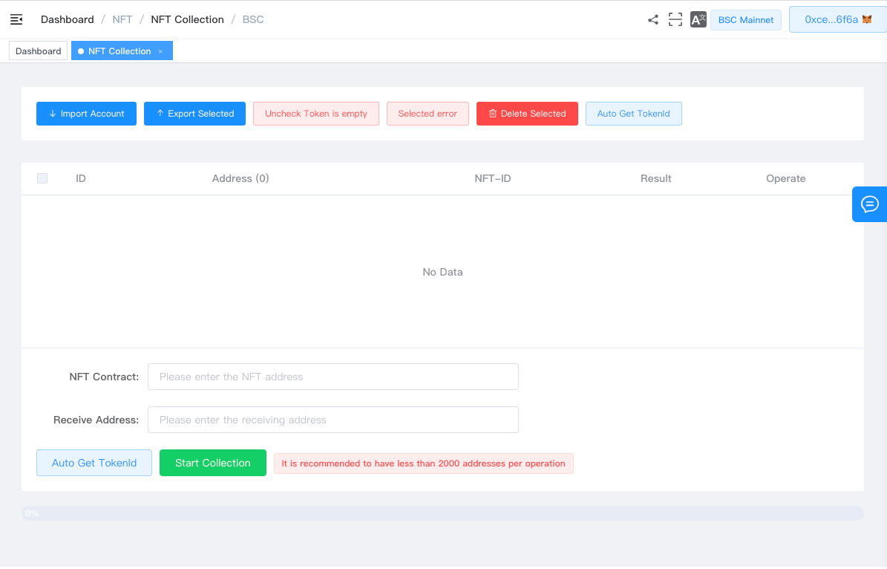
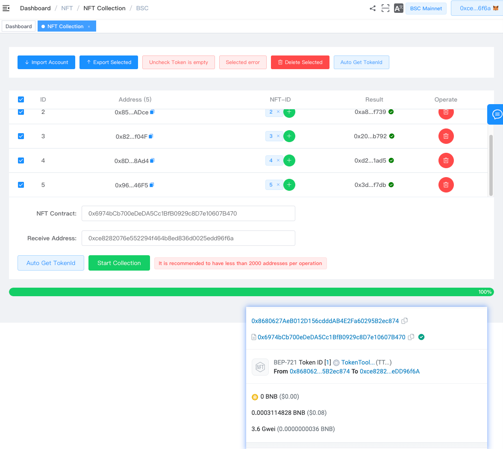

# NFT批量归集

> **TokenTool是一个区块链工具箱，支持ETH、BSC、等超多公链。**
> **推荐使用电脑版谷歌浏览器 + `Metamask` 插件钱包 进行操作.**
> **手机用户也可以在 `钱包APP`-发现-输入官网链接 进行操作.**

### 功能说明

```

NFT 批量归集功能允许用户将存储在多个地址中的 NFT合并到一个单一的地址或者合约中。
场景：将小号地址中的NFT批量发送到大号地址中

```

## 第一步骤



1. 打开NFT批量归集功能链接页面 [https://tokentool.info/nft/NftMoreToOne/bsc](https://tokentool.info/nft/NftMoreToOne/bsc)
2. 通过【import Account】按钮，导入需要归集的小号地址私钥。
3. 输入要归集的NFT合约地址后，点击【Auto Get TokenId】自动获取地址的NFTID。
   1. 如未能获取到NFTID，请手动编辑每个地址中存在的ID值。
4. 输入接收地址，发送到指定地址。



1. 开始归集操作，通过交易Hash，归集成功。


### 常见问题解答

- **为什么我的地址无法获取到ID值**
  - 解答：有可能你的NFT合约不存在通过地址查询ID的函数（例如不存在这些函数：`tokensOfOwner(address)`，`walletOfOwner(address)`，`getOwnerTokens(address)`)，这将会无法查询到ID，也有可能当前地址中没有NFT存在。

- **批量归集NFT小号地址需要保留矿工费吗**
  - 解答：需要，批量归集和你自己通过钱包转账一样，工具只是代替了你转账操作，最终还是地址发起了转账，所以需要gas矿工费，为了避免失败，尽量预留更多的矿工费。