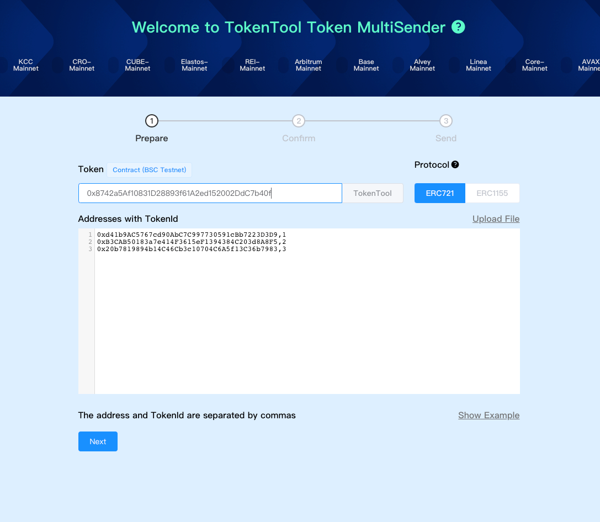
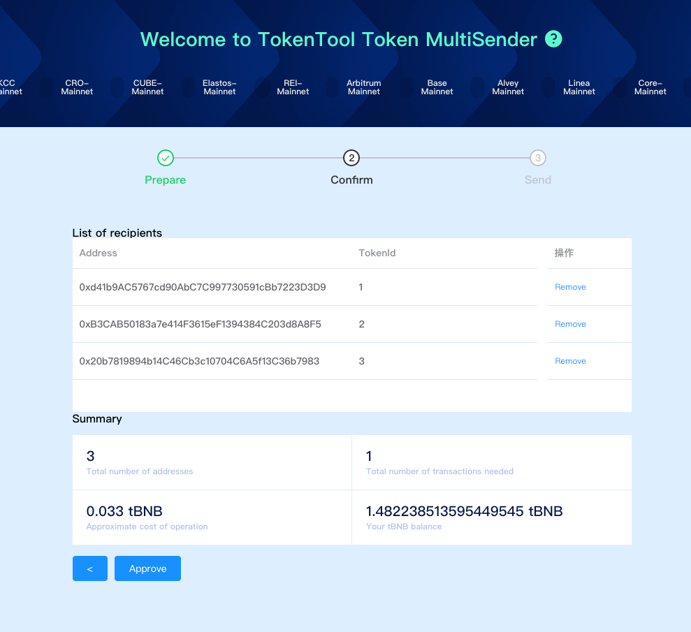
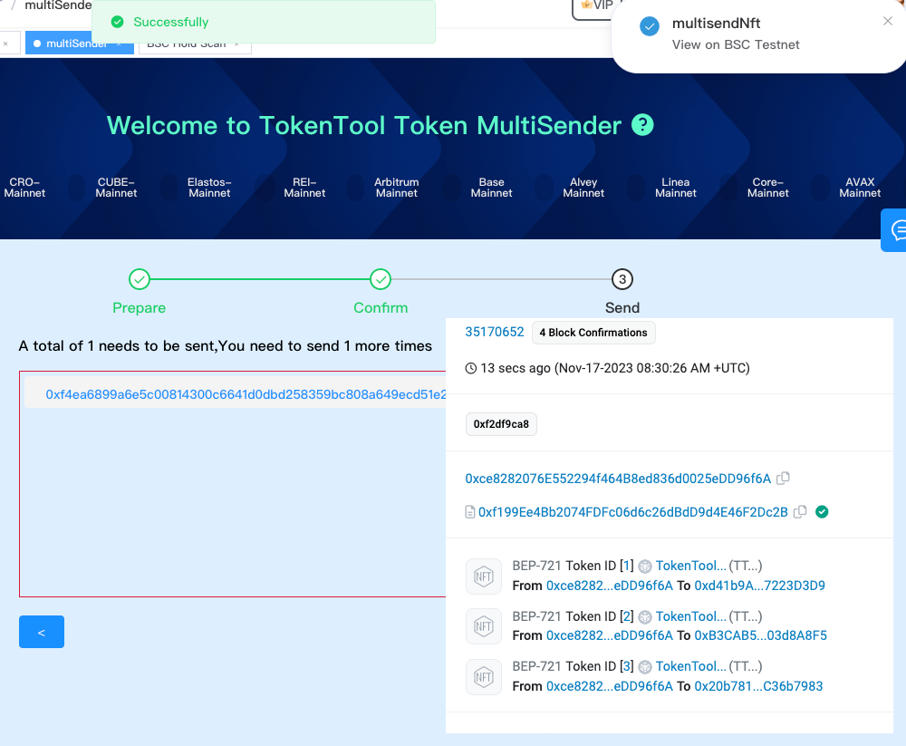

# NFT批量发送

> **TokenTool是一个区块链工具箱，支持ETH、BSC、等超多公链。**
> **推荐使用电脑版谷歌浏览器 + `Metamask` 插件钱包 进行操作.**
> **手机用户也可以在 `钱包APP`-发现-输入官网链接 进行操作.**

### 功能说明

```

NFT的批量发送功能允许用户以一次性操作的方式向多个地址发送多个 NFT。
场景：将当前链接钱包中的100个XX-NFT，发送给100个地址。
注意：需要知道钱包的NFT合约地址，以及每个NFTID，

```

## 第一步骤



1. 打开批量发送NFT功能链接页面 [https://tokentool.info/nft/multiSender/bsc](https://tokentool.info/nft/multiSender/bsc)

2. 粘贴要发送的NFT合约地址到输入框

3. 输入接收地址和接收的NFTID，可通过右下角【Show Example 查看例子】查看格式模版。
   1. 格式使用：地址,NFTID (⚠️注意逗号为英文逗号符)
   1. 例子中：`0xd41b9AC5767cd90AbC7C997730591cBb7223D3D9,1` 将NFTID为1的NFT发送给 `...3D3D9`地址
   
4. 也可以通过【Upload File】上传文件的xlsx表格的方式上传，格式需要根据[模版文件](https://tokentool.info/example.xlsx)的形式填入内容。


6. Address 为接收地址，Amount则是NFTID。

## 第二步骤



1. 确定发送地址、以及发送的NFTID
2. 点击Approve进行授权操作。
3. MetaMask 现在会要求您确认交易。如果您同意，请单击“确认”按钮以完成该过程。
4. 完成Approve授权操作后，进入下一步骤批量发送NFT。



