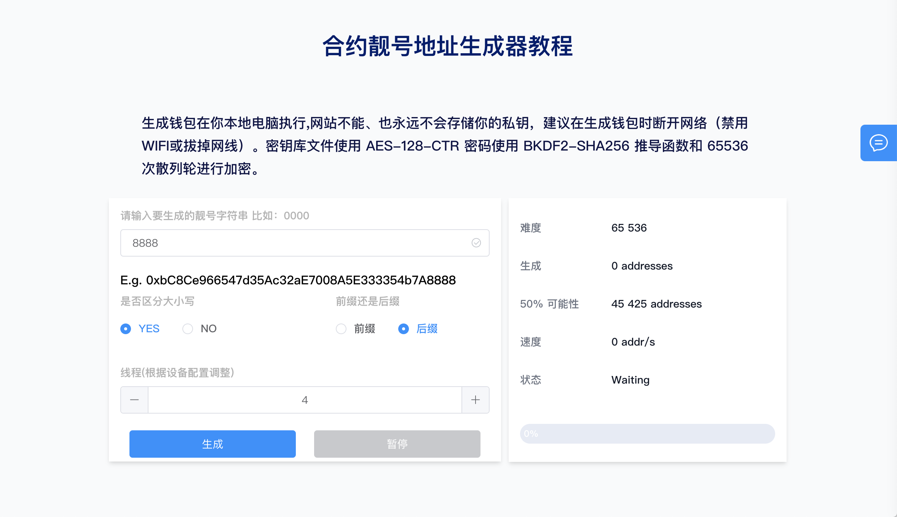
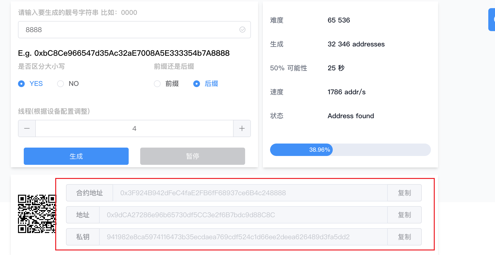
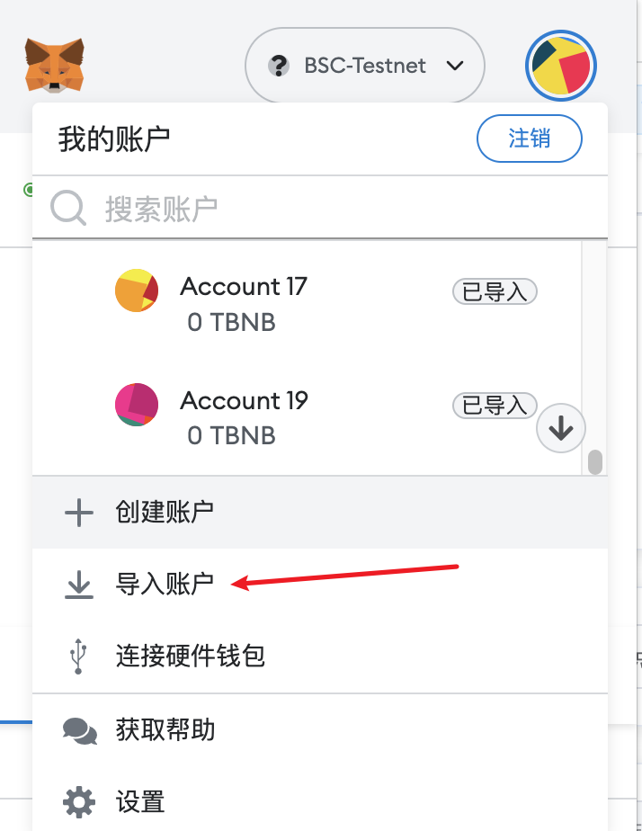
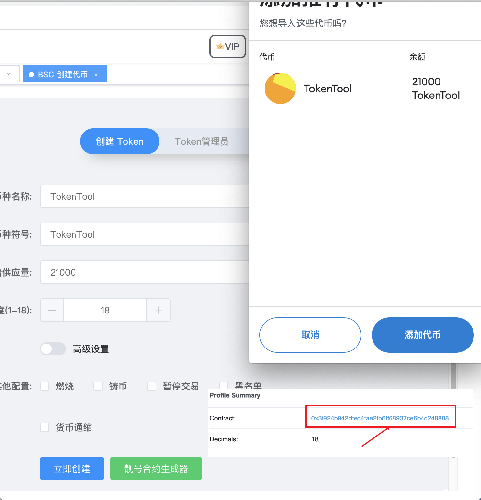

# 靓号合约地址生成

如何生成一个靓号的合约地址，例如：``0x0000000000004946c0e9f43f4dee607b0ef1fa1c`` 。
查看以下步骤，了解如何使用PC电脑端通过TokenTool平台的合约靓号生成器，生成靓号合约地址。

1. 打开[靓号合约生成](https://tokentool.info/other/vanityContractGenerator)地址：[https://tokentool.info/other/vanityContractGenerator](https://tokentool.info/other/vanityContractGenerator)

2. 输入您要生成的靓号字符串内容 **（温馨提示：在页面加载完成后，建议断开网络或关闭WI-FI离线生成）**

3. 如上图所示，生成后缀尾号8888的合约地址，并使用了4个线程。

4. 根据您的电脑配置，调整线程数量，生成的速度取决您的电脑CPU的核心线程数量，如越多生成的越快。

5. 成功后您可以看到： **合约地址**，**地址**，**私钥**  ，使用该地址第一次部署合约将会得到一个您靓号合约地址。

导入钱包地址，并转入足够支付部署发币合约手续费。现在您可以通过一键发币功能，部署合约。

**温馨提示 ：您可以使用该地址部署合约后，立马将合约的拥有权转移至大号地址并将大号地址加入白名单。**

**同时使用该地址在不同链上第一次发行代币，你将会得到相同的合约地址。**

**比如我在BSC链发币后得到：`0x0000000000004946c0e9f43f4dee607b0ef1fa1c` 地址。**

**同样我在 ETH链 第一次发行代币也讲会得到相同地址，其他链也类似。**

> 引用地址：
>
> [https://tokentool.info/other/vanityContractGenerator](https://tokentool.info/other/vanityContractGenerator) 合约靓号生成
>
> [https://tokentool.info/createToken/bsc](https://tokentool.info/createToken/bsc) 创建代币V1版本
>
> [https://tokentool.info/createToken/v2](https://tokentool.info/createToken/v2) 创建代币V2版本
>
> [https://tokentool.info/createToken/v3](https://tokentool.info/createToken/v3) 创建代币V3版本
>
> [https://tokentool.info/createToken/v4](https://tokentool.info/createToken/v4) 创建代币V4版本

