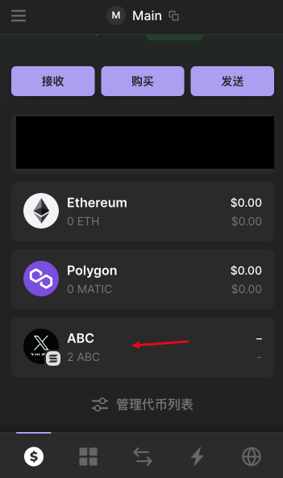
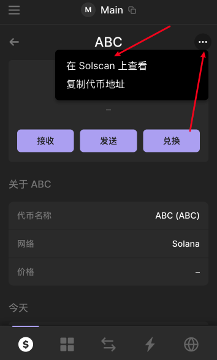
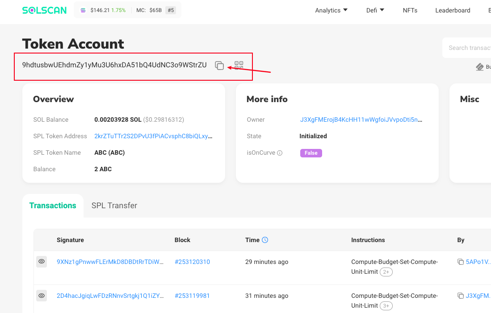
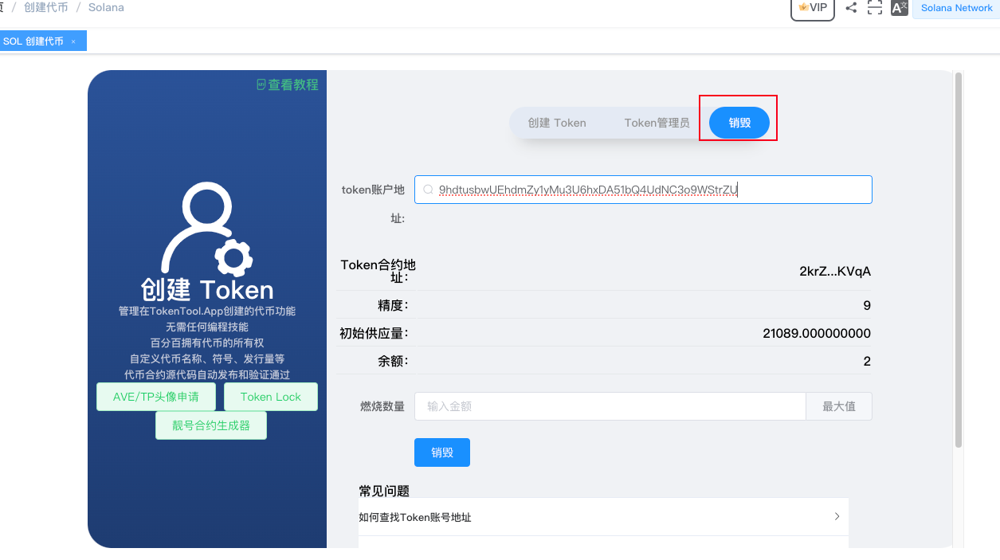
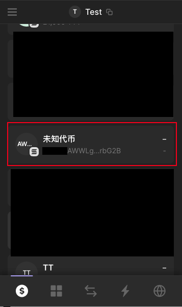
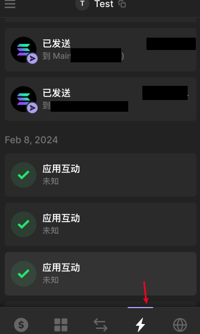
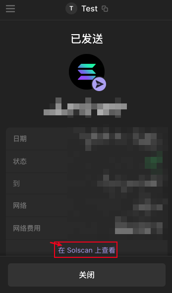
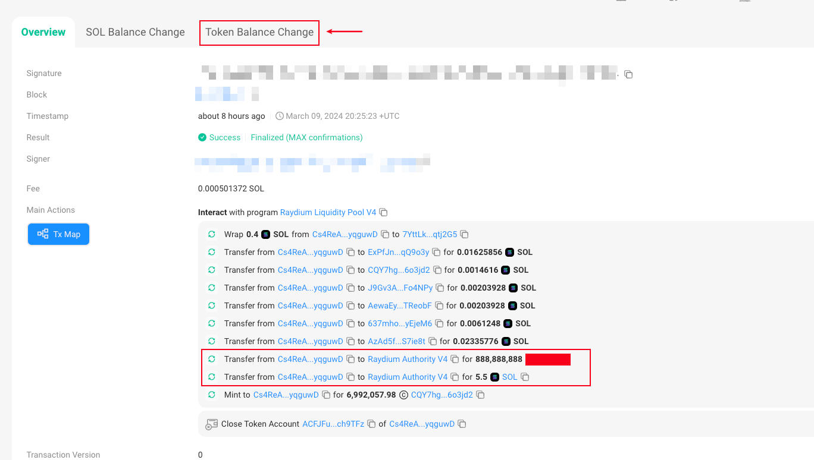
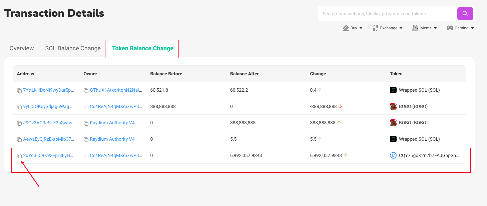

# 燃烧销毁Token/LP教程

如果将自己钱包中的资产，如SPL Token资产或者添加流动性后的LP资产进行销毁，由于钱包无法直接将资产转入黑洞地址。

⚠️注意（以下是燃烧销毁ABC Token代币的教程，如需要燃烧池子，需要找到对应的LP的账户地址，有关如何查看LP的账户地址，**《查看如何查询LP账户》**）

### 1、获取Token的账户地址

- 注意Token的账户地址不是Token合约地址，在SOL链中合约都会有一个账户地址。

- 打开钱包地址，在钱包列表中找到自己的资产Token或者LP的资产，并点击它。

- 在Solscan上查看，将会跳转到区块链浏览器窗口，（如下图显示）

- 在Solscan上查看，复制红色区域位置的地址，将是Token Account（账户地址），我们称这个地址就是Token账户地址。

### 2、进入SOL管理员操作

- 打开平台SOL发币页面[https://tokentool.info/createToken/sol](https://tokentool.info/createToken/sol)，在菜单中选择销毁菜单，如下图

**Token账户地址：** 将是上面通过区块链浏览器复制的Token账户地址，粘贴后，将会查询出Token合约地址，精度，总供应量，以及钱包余额。

**燃烧数量：** 输入或选择全部数量进行燃烧，（注意燃烧后的资产将进入黑洞地址，无法提取）

### 2、确认操作

- 点击 销毁按钮操作，进行钱包确认。

以上就是关于燃烧资产Token/燃烧池子的全部教程了，如果有任何问题，请进入我们的电报群，谢谢

### 如何查看LP池子的账户地址

- 方法一：如果钱包是第一次加池子操作，钱包中将会多出一个没有名称也没有logo的资产信息，如下信息，这个资产很可能是就是你的LP资产，点击资产后按照以上操作在solana浏览器查看账户地址。

- 方法二：资产中有很多未知代币，并不知道那个是正确的LP资产的情况下，通过最近交易记录，找到加池子记录。

- 通过查看浏览器记录，可以看到加池子的交易详细信息，如下图显示，添加了5.5个SOL 和 888,888,888 个代币，添加到Raydium Swap 中。

- 点击Token Balance Change 页面

- 可以看到我们钱包地址`Cs4ReAj...` 增加了 6,992,057.9843个 LP Token。
- `2uYq3LC9K92Fpr8EyH...` 将是我们要查找的 LP地址账户，复制改地址到 SOL发币页面[https://tokentool.info/createToken/sol](https://tokentool.info/createToken/sol)，在菜单中选择销毁菜单。进行以上步骤燃烧。

### 常见问题解答

- **我可以销毁LP吗？**
  
  - 解答：可以LP本身也是一个标准的Token资产，你需要在你的钱包列表找到并进行复制Token账户地址操作。

    
  
- **销毁操作需要多少SOL？**
  
  - 解答：钱包至少需要保留0.2SOL，建议最少保留0.25个SOL。

    
  
- **如果把LP池子销毁后将会怎么样？**
  
  - 解答：如果你把LP池子销毁了，等于你的池子永久性无法撤池子。
  
    
  
  
