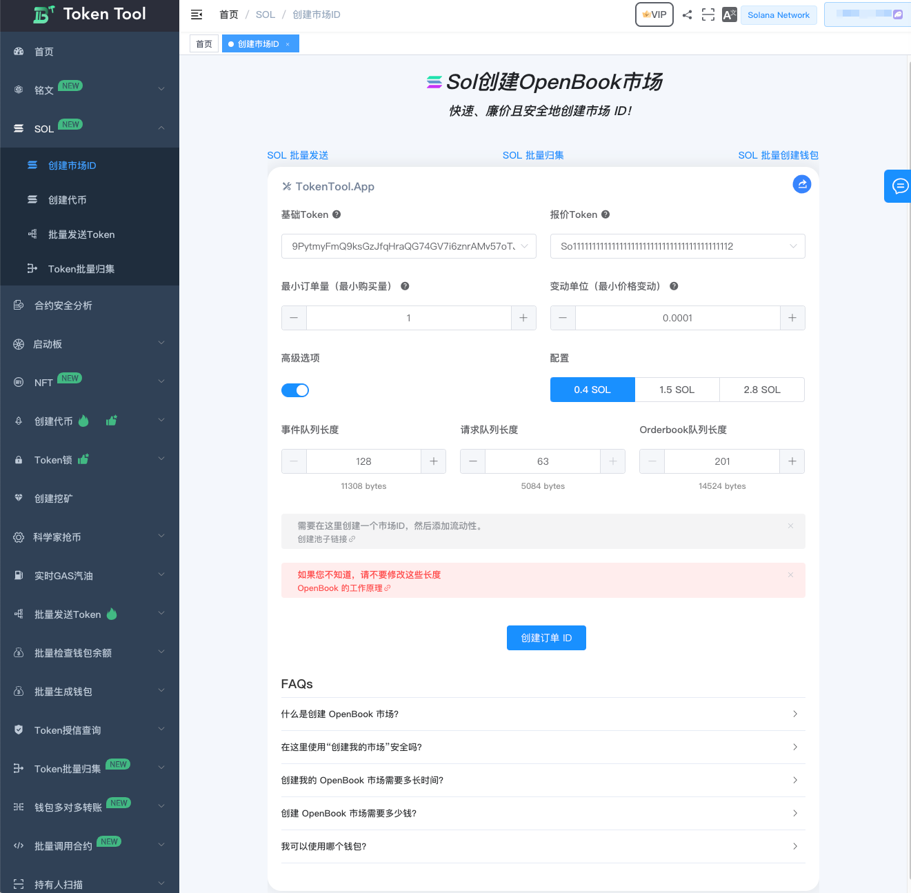
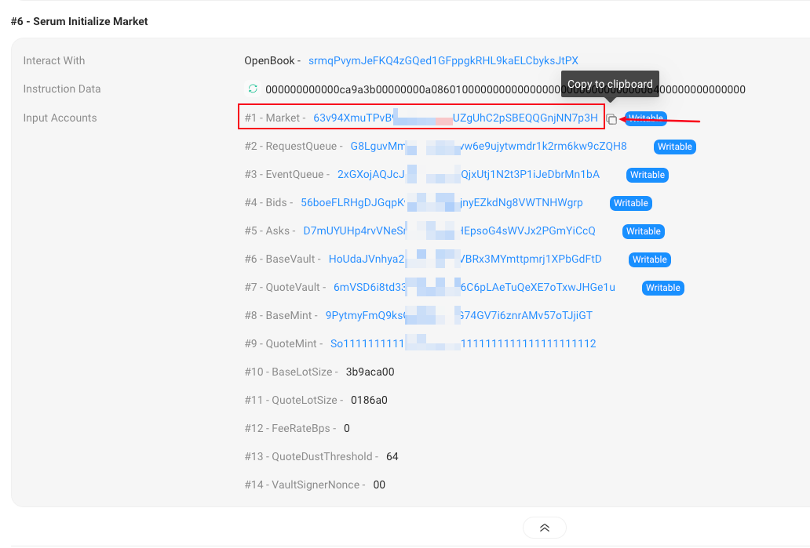
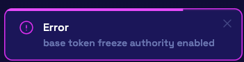

# Raydium创建廉价的 OpenBook ID

如果您想在 Solana 上创建一个 OpenBook 市场或市场 ID，也就是一对用于创建流动性池的代币，那么本文适合您。

我们将教您如何在仅 1 分钟内创建一个 OpenBook，而且无需编写任何代码。而且，它的价格只需 0.4 SOL，比 Raydium 更便宜。

### 什么是 OpenBook 市场

在继续创建我们的市场 ID 之前，我们必须了解它的含义和工作原理，以便以最佳方式进行操作，并充分利用我们的 Solana。

我们将“市场”或“OpenBook 市场”定义为创建一个“市场”，在该市场上，一对代币被交换。也就是说，在 Solana 中，我们称之为“市场”概念就是“代币对”。

这个市场占据了区块链上的一个空间，允许处理该代币对的交易。

如果我们在任何 DEX 中为这对代币添加流动性，用户就可以自由交易，这要归功于流动性池。

### 创建 OpenBook 市场的费用是多少

在 Solana 中创建 OpenBook 市场的成本取决于市场的规模。这个规模会影响市场可以处理的交易数量。

理论上，“最佳”规模将花费我们大约 2.7-3 SOL。但实际上，我们可以从少于 0.5 SOL 开始创建市场。

在本文中，我将向您展示如何用 0.4 SOL 来完成，但首先我们必须讨论风险。

### 廉价 OpenBook 市场的问题

以比通常支付的价格低 5 倍创建我们的 OpenBook 市场是很好的，但我们不能忽略在某些情况下可能遇到的问题。

如果您有能力，应始终使用“最佳”市场。稍后我将向您展示如何选择任何一种选项。

根据与我们分享的经验，通过“廉价”市场，我们已经看到了市值为 500,000 美元的代币没有任何问题。

如果您计划创建一个“严肃”的项目而不是一个嘲讽币，我不建议您在开支上吝啬。

无论如何，如果您选择成本最低的选项，您应该使用比正常情况下更大的“最小订单量”，以避免微型交易占据 OpenBook 市场的空间。

总之，主要问题在于我们的代币具有许多交易，并且其中一部分由于无法被我们的市场处理而产生错误。

### 逐步创建 OpenBook 市场
我们的工具允许您调整 OpenBook 市场的长度。这使得整个过程变得更便宜，尽管存在以上提到的缺点。在这种情况下，我将向您展示我认为最有用的“设置”：0.4 SOL、1.5 SOL 和 2.8 SOL。

让我们直接进入在 Solana 中创建 OpenBook 市场 ID 的逐步过程，而无需编写任何代码。为此，我们将使用我们的 dApp，名为“创建 OpenBook 市场”，这是一个软件，可以让我们在短短 1 分钟内创建和定制我们的市场 ID。

1. 访问“创建 OpenBook 市场” [https://tokentool.info/sol/openbook-market](https://tokentool.info/sol/openbook-market)

   连接您的钱包，以便能够使用该软件。

2. 选择“Base Token”。即您创建的尚无价值的代币。

3. 选择“Quote Token”。一个具有市场价值的代币。通常是 SOL 或 USDC。

4. 设置“最小订单量”。即用户将能够购买您的代币的最低数量。

5. 设置“价格跳动”。即可以改变您的代币价格的最小数量。

6. 选择高级选项（仅当您想使用低于 2.8 SOL 的市场时，默认情况下按照2.8SOL进行创建）。

完成这个过程，点击“创建市场”并接受交易。

### 常见问题解答

- **为什么平台创建怎么便宜？**
  - 解答：平台把创建的费用进行`低`、`中`、`高`配置进行划分。Raydium 官网创建ID时，默认是最高配置进行创建，创建时需要2.7左右的SOL费用，我们通过参数化让用户有更多的选择，根据自己的币的交易情况选择。

- **创建便宜和贵的ID有什么影响/区别？**
  - 解答：有影响，你可以理解成创建ID，就跟创建一个电脑一样，高配(32G内存)，中配(16G内存)，低配(8G内存) 的电脑一样，他在SOL链上处理速度会比较慢，根据与我们分享的经验，通过“廉价”市场，我们已经看到了市值为 500,000 美元的代币没有任何问题。如果你的币不是单纯是Meme迷因币，想要长期发展，建议你选择“最佳”规模2.7SOL进行创建。

- **我创建时一直转圈圈很久怎么办？**
  - 解答：如果你转圈圈很久一直没有反应，说明网络原因导致请求无法上链，或者有可能是重复创建的情况也有可能，可以根据钱包资产进行查看是否有扣款成功至少2笔的记录。如果2分钟左右没有成功，可以点击停止重新点击创建按钮，重新发起创建过程。

- **我创建成功了，但是忘记复制ID了怎么办？**
  - 你可以联系我们管理员帮你查看，你也可以通过区块链浏览器[https://solscan.io/](https://solscan.io/)搜索你的钱包地址，查询到如下图片所示的信息，复制这个Market地址就是你的市场ID了。
  - 
- **在加池子的时候出现以下情况错误如何处理？**

  - 因为你的token管理员权限没丢，请到[Token管理员页面](https://tokentool.info/createToken/sol)[https://tokentool.info/createToken/sol](https://tokentool.info/createToken/sol)，放弃冻结和增发权限。
