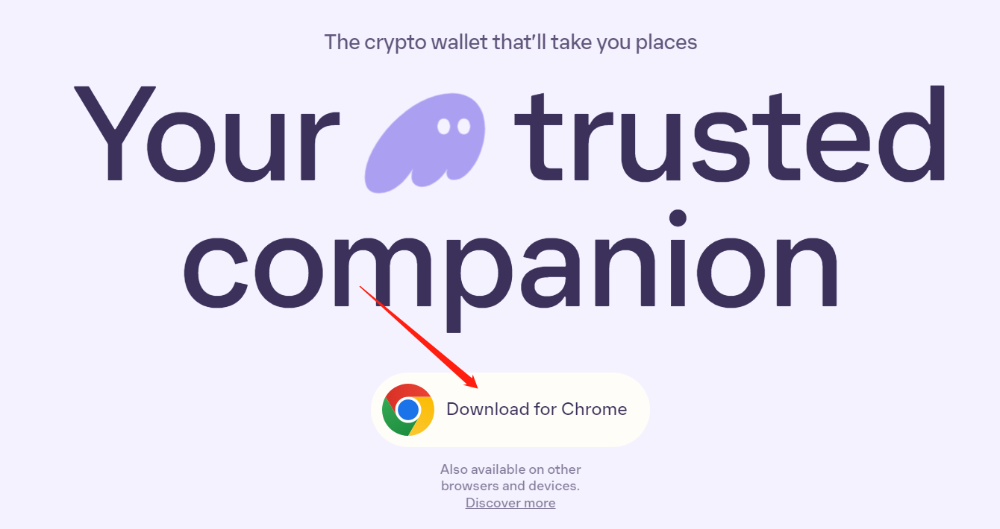
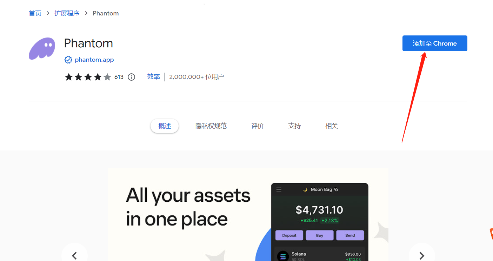
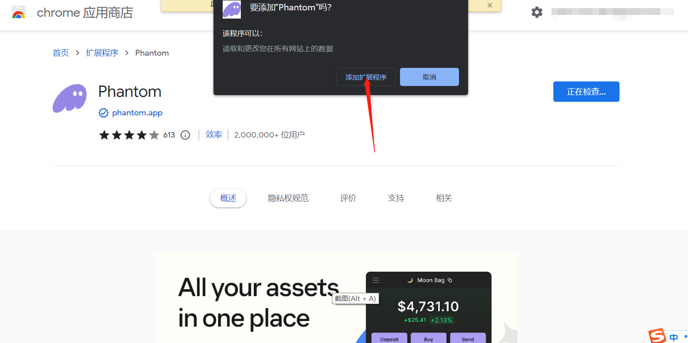
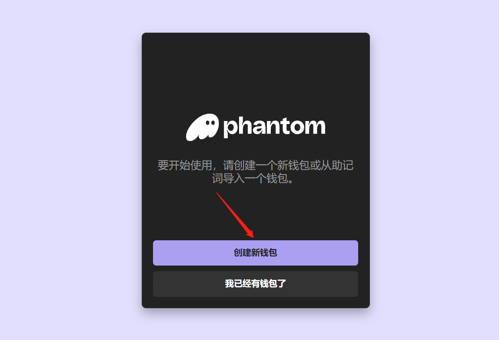
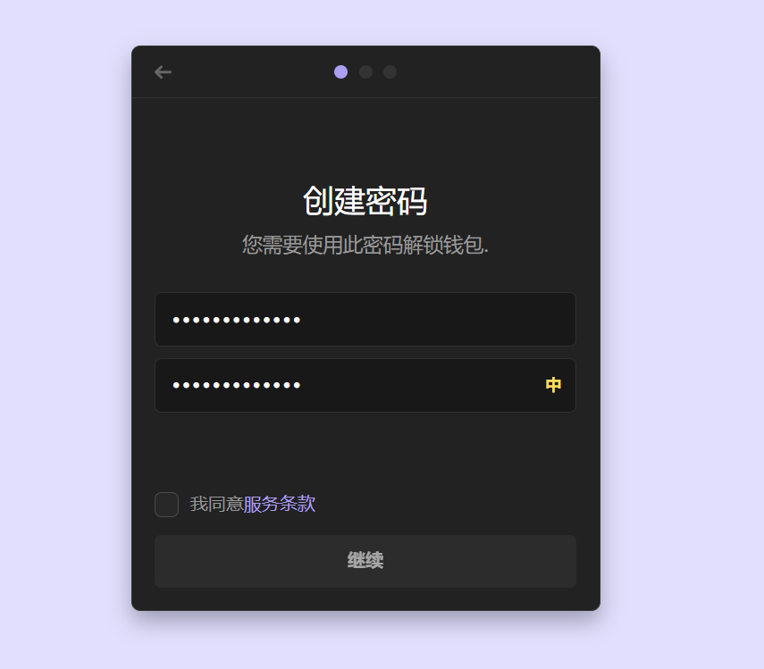
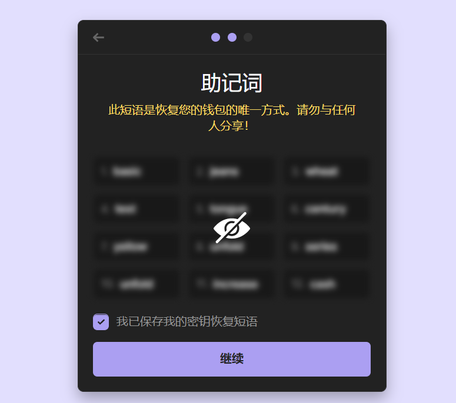
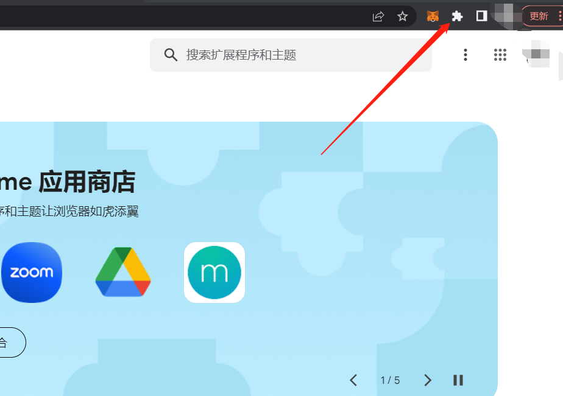
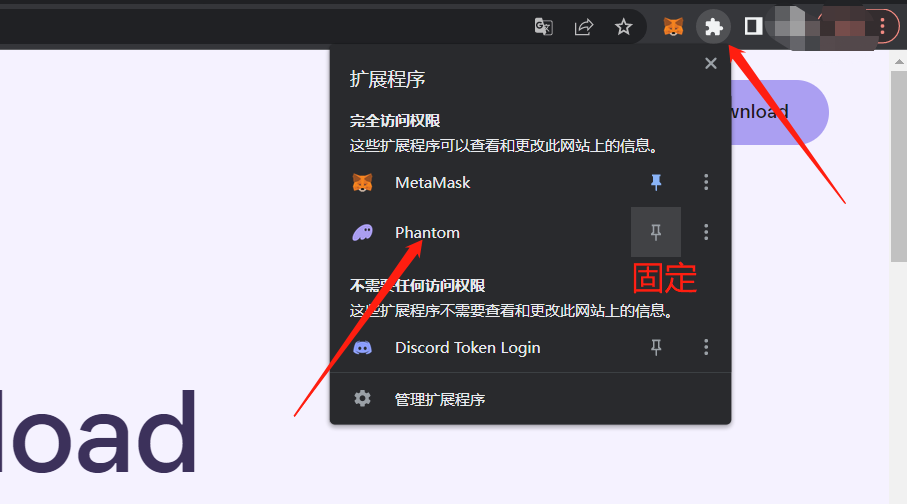
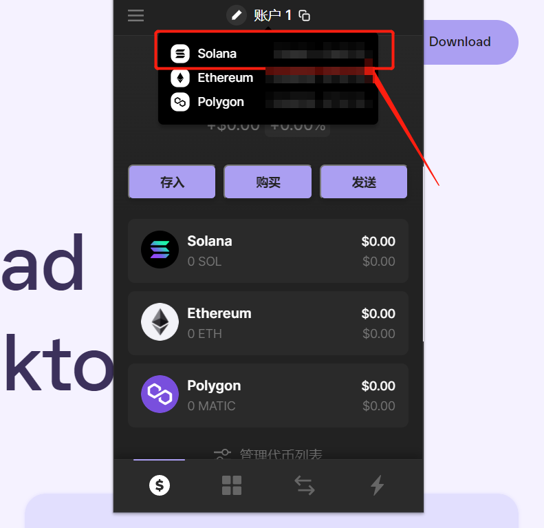

# 幻影钱包Phantom安装教程

> Solana生态最常见的钱包

Phantom中文称之为“”幻影钱包”，是一个浏览器插件，可以让我们在 Solana 区块链上存储、发送、接收、质押和交易代币。

目前，Phantom已成为用户参与Solana区块链时的首选钱包。如果你想使用TokenTool工具发行代币，就必须先安装Phantom钱包，下面给大家介绍一下安装教程：

1. 首先打开 Phantom 钱包官网：[https://phantom.app/](https://phantom.app/)，点击“Download For Chrome”。

2.  如下图所示，点击“添加至Chrome”

3.  然后会弹出提示“添加扩展程序”，点击添加

4. 之后，会让你进行选择：如果你还没有sol钱包，就可以立即创建一个新钱包。如果你在TP等其他平台已经创建了钱包，就可以通过私钥/助记词导入钱包，这里我们选择创建钱包：

5. 之后需要创建一个钱包密码，这里和小狐狸一样

6. 保存你的钱包助记词，确保周围没有摄像头或者其他人

7. 至此，Phantom钱包就算注册安装完成了。你可以通过浏览器右上角的插件图标，找到你的钱包

8. 钱包创建完成后，我们复制SOL地址，再从交易所提SOL代币到这个地址，就能开始发币或者交易了

注意事项

1. 安装钱包必须在翻墙状态下，没有VPN的话，不建议大家操作

2. Phantom钱包不仅支持Sol链，也支持以太坊、马蹄链，所以创建钱包之后会有3个地址。大家提币或者转账，一定要选择复制Solana地址，不要选错了