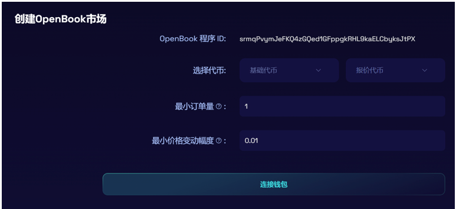
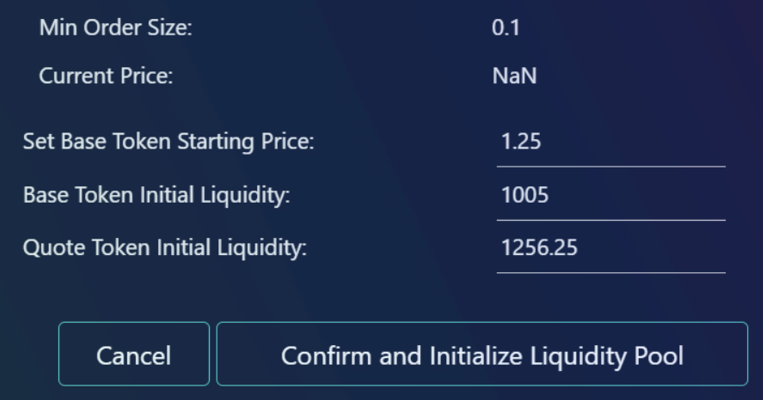

# Raydium创建流动性(做池子)教程

Sol链上最大DEX

Raydium是SOL链上比较大的去中心化交易所，任何人都可以在上面创建流动性资金池。一旦创建了池子，它就可以立即在Raydium交换界面上交易。

以下是Raydium做池子的教程：

### 1、获取OpenBook市场ID

- 在此链接处创建OpenBook市场ID：[https://raydium.io/create-market/](https://raydium.io/create-market/)

- 请注意，创建ID的费用大概在**3-4 SOL**之间（每个ID只能对应一个代币对，不可重复使用）

**选择代币：**基础代币就是你自己发行的代币，报价代币就是Sol或者USDT或者USDC等

**最小订单量：**每次交易可以允许的最小订单，以“BTC/USDC”这个交易对为例。如果这里设置0.0001，就意味着用户单次交易不得少于0.0001个BTC。理论上来说，这个数量越小越好

**最小价格变动幅度：**每次交易价格波动的范围，一般来说不得超过你代币初始价格的千分之一。假设你是用USDC做池子，代币上线价格是1U，那么这个数值要小于0.001。如果是用SOL做池子，代币上线价格同样为1U的话，这个数值应该小于0.00001.（以Sol价格为100U为例）

### 2、加池子

创建OpenBook市场后，将会跳转到Raydium的[流动性页面](https://raydium.io/liquidity/)。页面向下滚动并单击底部的“创建池”按钮。

- 注意：如果没有获得OpenBook市场ID，是不能添加流动性的

### 3、确定价格和比例

- 设置基础代币的起始价格：这是购买1个基础代币所需的报价代币数量。

- 设置基础代币和报价代币的初始流动性：您可以输入一个方向的初始流动性，另一个方向将根据基础代币的起始价格进行计算。

- 设置您希望池在哪个日期和时间启动。

- 确保您的钱包中有足够的资金用于此初始流动性，然后单击“确认并初始化流动性池”。

**重要提示**：确认并初始化池后，您将无法再编辑起始价格、流动性或开始时间。注意，开始时间由链上的时间确定。

- 单击确认后，需要在钱包中批准**两个单独的交易**。这些交易将创建池子，创建AMM帐户和ID，并从您的钱包中添加流动性。如果您没有看到其中一个交易，请检查您的钱包窗口是否隐藏在主浏览器窗口后面。如果您错过了确认交易，则该过程将失败，您需要再次单击确认，然后重新批准所有交易。

-  确认钱包中的两个交易后，新LP将已创建，您将获得新的AMM ID，并且底池将在设置的启动时间启动。

### 4、撤池子

如果你确认自己已经添加池子，可以在Raydium页面选择Liquidity，然后页面往下拉一拉，就能看到自己的流动性了

点击你的流动性，能看到一些选项，添加流动性或者交易，这时候请选择撤出流动性，如下：

然后填入你要撤出的LP数量，点击“Remove Liquidity”，钱包确认后，就能撤出了。（如果选择MAX，就是全部撤出）

好的，以上就是关于Raydium加池子/撤池子的全部教程了，如果有任何问题，请进入我们的电报群，谢谢