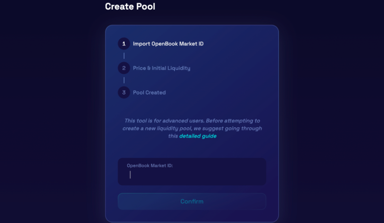
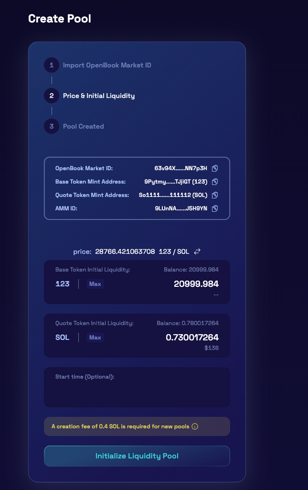
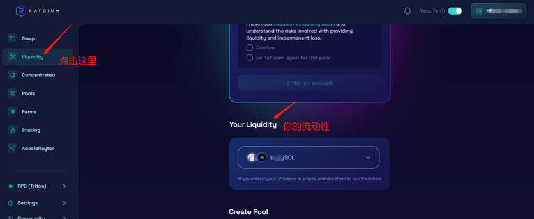
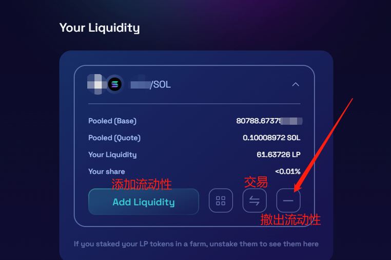
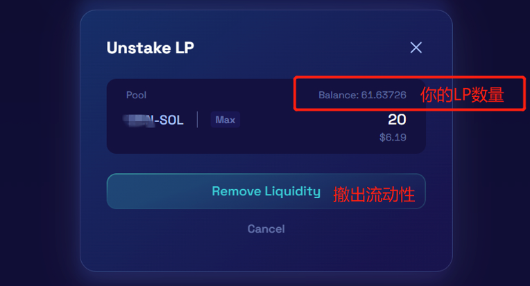

# SOL流动性管理教程

Raydium是SOL链上比较大的去中心化交易所，任何人都可以在上面创建流动性资金池。一旦创建了池子，它就可以立即在Raydium交换界面上交易。由于SOL网络拥堵，Raydium卡顿，无法显示流动性等信息。TokenTool 专门开发了SOL流动性管理工具，可在几秒钟内即可非常轻松地创建、添加和删除您的流动资金池！

以下是SOL流动性管理的教程：

### 1、创建流动性

- 在此链接处创建OpenBook市场ID：[https://raydium.io/create-market/](https://raydium.io/create-market/)

- 请注意，创建ID的费用大概在**3-4 SOL**之间（每个ID只能对应一个代币对，不可重复使用）

- 想要低价格创建OpenBook市场ID，可查看[廉价ID创建教程](https://docs.tokentool.info/sol/cheap-raydium)[https://docs.tokentool.info/sol/cheap-raydium](https://docs.tokentool.info/sol/cheap-raydium)

### 2、移除流动性

创建OpenBook市场后，将会跳转到Raydium的[流动性页面](https://raydium.io/liquidity/add/)。[https://raydium.io/liquidity/add/](https://raydium.io/liquidity/add/)页面向下滚动并单击底部的“创建池”按钮。

- 注意：如果没有获得OpenBook市场ID，是不能添加流动性的

### 3、初始化创建池子

- 设置要添加多少币和多少SOL代币到池子中。

- 设置您希望池在哪个日期和时间启动。

- 确保您的钱包中有足够的资金用于此初始流动性，然后单击“确认并初始化流动性池”。

**重要提示**：确认并初始化池后，您将无法再编辑起始价格、流动性或开始时间。注意，开始时间由链上的时间确定。

- 单击确认后，需要在钱包中批准**两个单独的交易**。这些交易将创建池子，创建AMM帐户和ID，并从您的钱包中添加流动性。如果您没有看到其中一个交易，请检查您的钱包窗口是否隐藏在主浏览器窗口后面。如果您错过了确认交易，则该过程将失败，您需要再次单击确认，然后重新批准所有交易。

- 确认钱包中的两个交易后，新LP将已创建，您将获得新的AMM ID，并且底池将在设置的启动时间启动。

-  创建池子时需要0.4SOL的手续费，钱包请确保预留足够多的手续费和加池子的费用

### 4、撤池子

如果你确认自己已经添加池子，可以在Raydium页面选择Liquidity，然后页面往下拉一拉，就能看到自己的流动性了

点击你的流动性，能看到一些选项，添加流动性或者交易，这时候请选择撤出流动性，如下：

然后填入你要撤出的LP数量，点击“Remove Liquidity”，钱包确认后，就能撤出了。（如果选择MAX，就是全部撤出）

好的，以上就是关于Raydium加池子/撤池子的全部教程了，如果有任何问题，请进入我们的电报群，谢谢