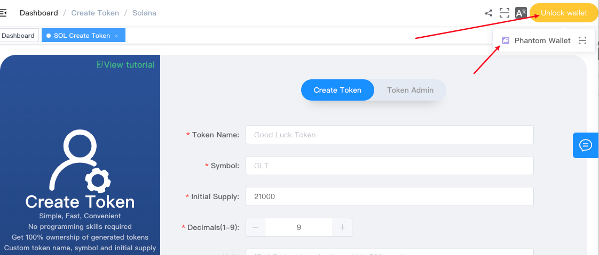
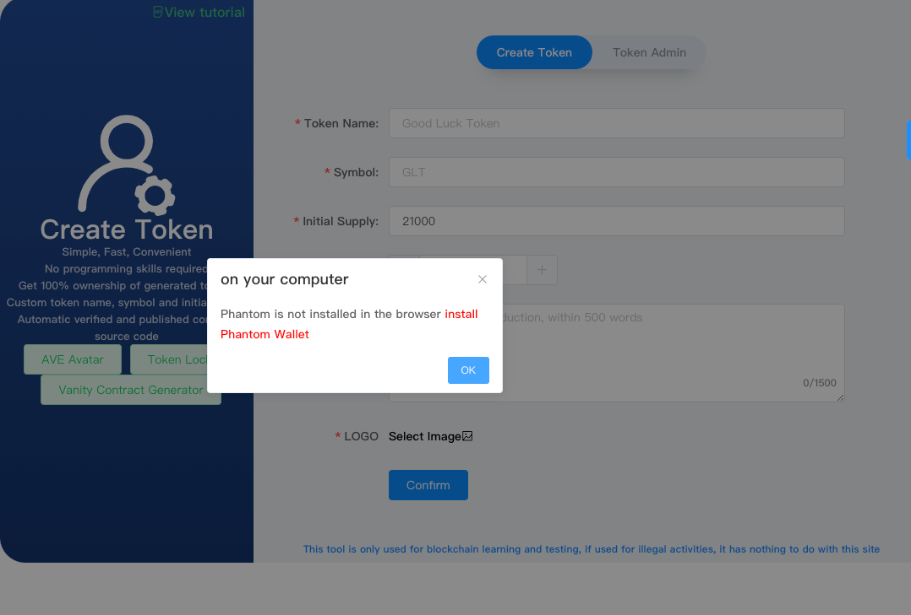
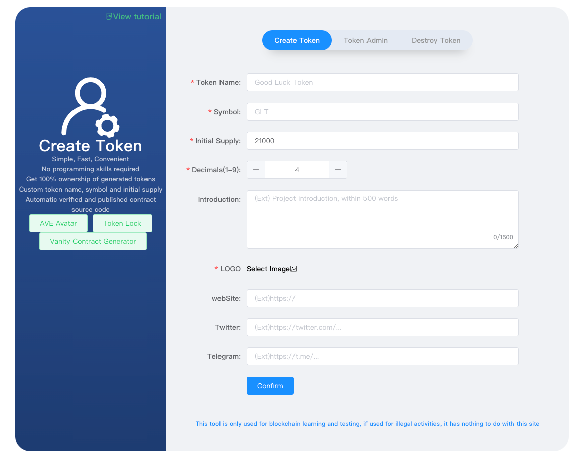
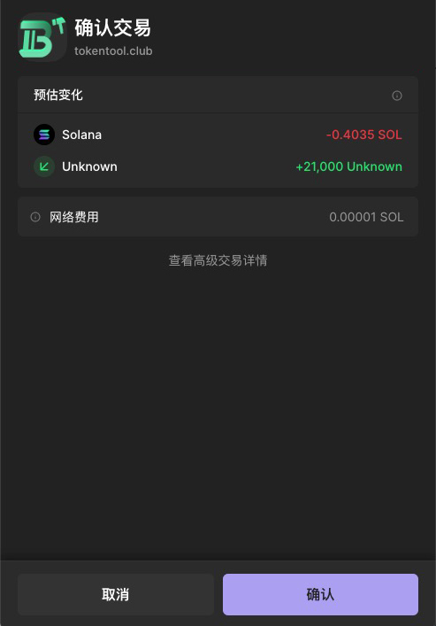
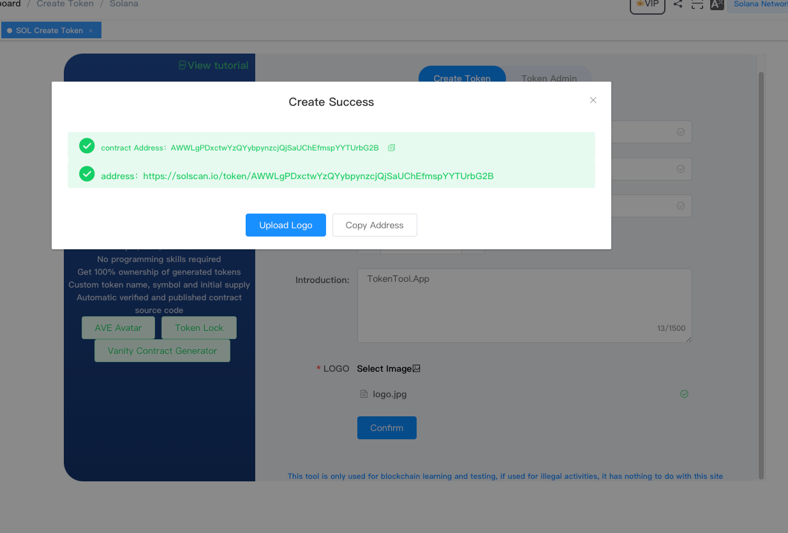
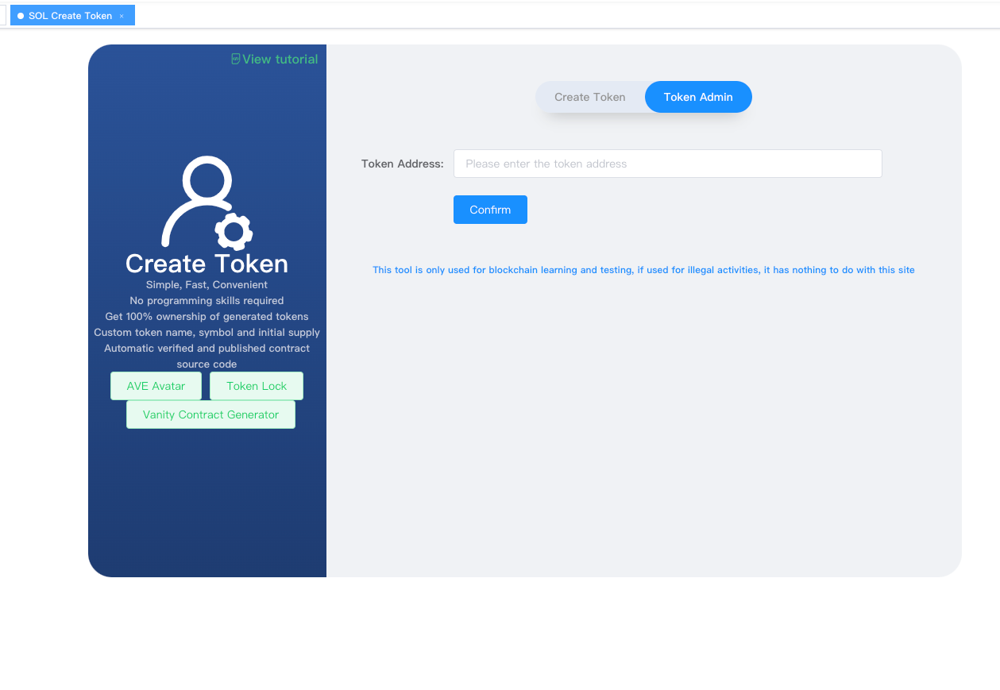
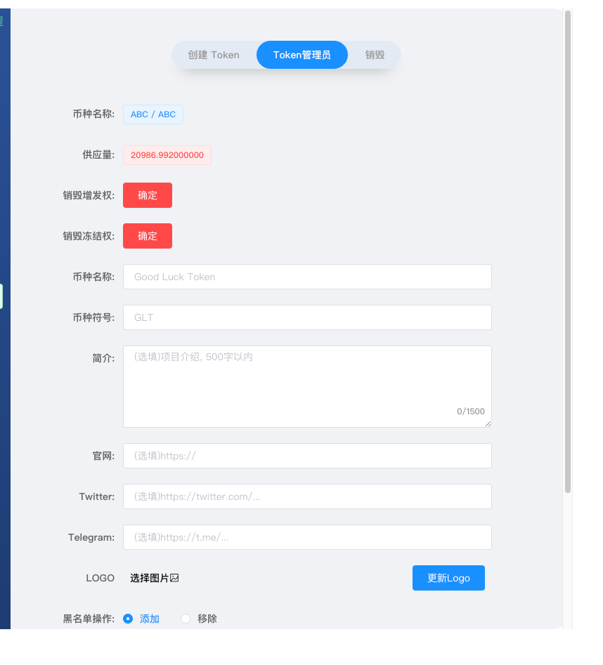
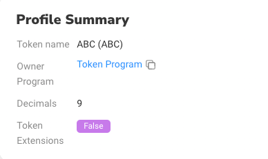
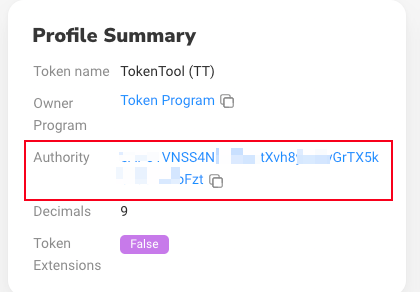

# Solana一键创建代币

> **TokenTool是一个区块链工具箱，支持ETH、BSC、BTC、SOL、等超多公链，可以创建多种不同机制模型代币，轻松解决发币问题，可在几分钟内创建一个属于你自己的Token。**


> **点击加入 [TokenTool官方交流群](https://t.me/tokentool_app) 交流反馈**


> **推荐使用电脑版谷歌浏览器 + `Phantom` 插件钱包 进行操作.**
> **手机用户也可以在 `Phantom钱包`-发现-输入官网链接 进行操作.**


### 机制说明

```

Solana的代币，无任何机制。
USDT类似。检测没有任何机制。
Solana链的代币无开源一说。
支持任何交易对，可以添加SOL，USDT等稳定币，可在不同的swap交易所添加流动性

```
## Sol发币教程

##### 1. 打开发币链接地址[https://tokentool.info/createToken/sol](https://tokentool.info/createToken/sol)，连接幻影钱包Phantom



##### 2. 如出现此提示错误表示未安装正确钱包插件，点击"install Phantom Wallet" 进行安装钱包插件。



##### 3. 填写以下代币基本信息，以及上传Logo图片信息后。

## 代币基本信息

首先我们通过可视化界面创建代币，通过 [https://tokentool.info/createToken/sol](https://tokentool.info/createToken/sol) 打开创建代币功能.填写代币信息.




**币种名称：** 代币的名称信息（如BitCoin）

**币种符号：** 代币的符号信息（如BTC）

**初始供应量：** 代币的总供应量

**精度：** 代币的精度位数（精度是代表币的小数位数`如：0.000001`代表有6为精度，最大可设置9）

**简介：** 代币描述介绍信息

**LOGO：** 代币头像，可在钱包中显示logo代币图片（注意上传的图片大小不可超过100KB大小）

**webSite：** 官网链接地址（如果没有可以不填写）

**Twitter：** 推特地址（如果没有可以不填写）

**Telegram：** 电报地址（如果没有可以不填写）


##### 4. 点击确认按钮创建。



##### 4. 创建完成后，请复制好合约地址即可




## Token管理员

查看以下步骤，了解如何使用 Phantom 通过 TokenTool 进入Token管理员页面。


##### 1. 点击管理员菜单栏



##### 2. 粘贴合约地址点击确认进入管理员页面




1. **销毁冻结权限：** 将黑名单权限销毁
2. **销毁增发权限：** 将增发代币的权限销毁
3. **更新logo：** 修改logo图片，以及币的名称和简称，官网地址链接信息等等。SOL链不同在创建完成后还可以修改名称和简称以及logo图片。
4. **黑名单操作：** 可以对某个地址加入黑名单，加入黑名单后，该地址无法转出和买卖代币。
5. **铸币操作：** 如在未放弃增发权限时，你可以增发固定代币数量，到指定地址。


### 常见问题解答
- **如何查看token是否还有权限**
  - 解答：可以通过Solana区块链浏览器查看，通过 [https://solscan.io/token/合约地址](https://solscan.io/token/合约地址)，查看是否存在Authority 关键字地址。
  - 

- **token权限都有什么作用**
  - 解答：权限分2种，增发代币 和 冻结用户地址的Token，功能已开放，进入管理员页面进行操作，黑名单可以添加/移除某个指定地址，增发可以增发代币到某个指定地址。

- **我能在那些Swap添加流动性？**
  - 解答：Solana链代币无任何机制，可以在任何swap上加池子，常用的交易平台有 **[Meteora](https://app.meteora.ag/)、[Orca](https://www.orca.so/create-pool)、[Raydium](https://raydium.io/create-market/)**

- **能和`USDT` `SOL` 等稳定币加池子吗?**
  - 解答：无税模板能够任何代币组成池子

- **无税模板有开关吗?**
  - 解答：无税模板没有任何开关

- **在创建时我忘记上传logo，对话框已经被关闭了，怎么办?**
  - 解答：可以通过合约地址进入管理员页面，进行重新上传logo步骤。

- **忘记复制合约地址，对话框已经被关闭了，怎么办?**
  - 解答：可以通过钱包记录查看，或通过[浏览器](https://solscan.io/)[https://solscan.io/](https://solscan.io/)地址，输入钱包地址后进行查询token信息。
- **上传logo和更新资料要收费？**
  - 解答：由于Solana链的不同，token的信息需要被存储在Arweave(AR)永久存储链后，在进行把信息发送到Solana链上，在传输至链上，因此需要收取一些存储费用
- **如何燃烧代币或者池子**
  - 如果你要燃烧代币或者池子，你需要找到对应的账户地址，可以查看关于如何燃烧币或池子教程[https://docs.tokentool.info/sol/burn-assets](https://docs.tokentool.info/sol/burn-assets)


> 原文链接：[https://docs.tokentool.info/token/sol](https://docs.tokentool.info/token/sol)
> 
> Phantom钱包链接：[https://phantom.app](https://phantom.app)

