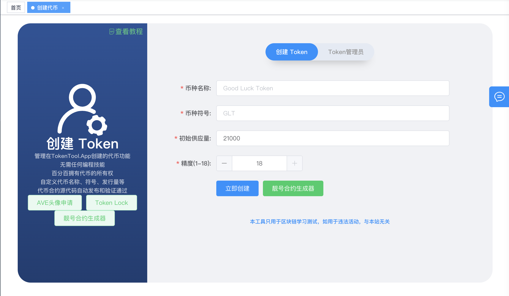
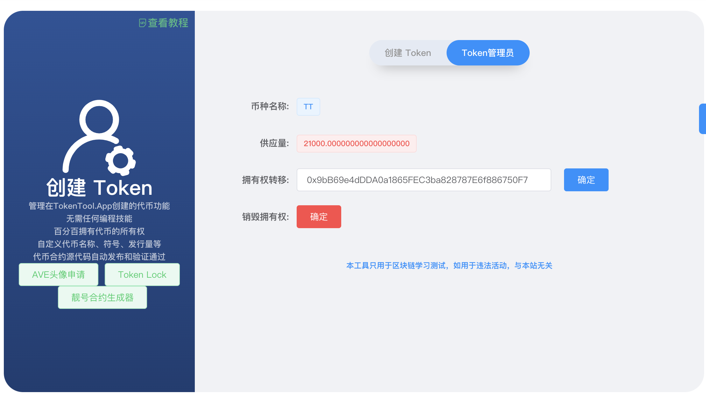

# 创建一个【标准ERC20】代币

> **TokenTool是一个区块链工具箱，支持ETH、BSC、等超多公链，可以创建多种不同机制模型代币，轻松解决发币问题，可在几分钟内创建一个属于你自己的Token。**


> **点击加入 [TokenTool官方交流群](https://t.me/tokentool_app) 交流反馈**


> **推荐使用电脑版谷歌浏览器 + `Metamask` 插件钱包 进行操作.**
> **手机用户也可以在 `TP钱包`-发现-输入官网链接 进行操作.**


### 机制说明

```

标准ERC20代币，无任何机制。
USDT类似。检测没有任何机制。
检测合约机器人，全绿。
所有链都支持，支持任何交易对，可在不同的swap交易所添加流动性

```


## 代币基本信息

首先我们通过可视化界面创建代币，通过 [https://tokentool.info/createToken/standard](https://tokentool.info/createToken/standard) 打开创建代币功能.填写代币信息.



**币种名称：** 代币的名称信息（如BitCoin）

**币种符号：** 代币的符号信息（如BTC）

**初始供应量：** 代币的总供应量

**精度：** 代币的精度位数（精度是代表币的小数位数`如：0.000001`代表有6为精度）


## Token管理员

查看以下步骤，了解如何使用 MetaMask 通过 TokenTool 进入Token管理员页面。




1. **拥有权转移：** 可以将来owner权限转移给第三者 或者 其他地址
2. **销毁权限：** 将owner地址转移给 `0x0000000000000000000000000000000000000000`地址


### 常见问题解答
- **没有任何开关,为什么查出所有权是我自己?**
  - 解答：因为任何ERC20代币标准模板都有所有权,不过你可以进入管理员页面 **销毁权限**


- **我能在`薄饼swap` `宝贝狗swap` ….上加池子吗?**
  - 解答：无税模板能够在任何swap上加池子
- **能和`USDT` `Doge` `SHIB` 加池子吗?**
  - 解答：无税模板能够任何代币组成池子
- **无税模板有开关吗?**
  - 解答：无税模板没有任何开关
- **检测合约机器人/检测合约会被检测危险信号吗？**
  - 解答：不会，检查出来是全绿色，无任何开关/危险信号。


> 原文链接：[https://docs.tokentool.info/token/standard](https://docs.tokentool.info/token/standard)

