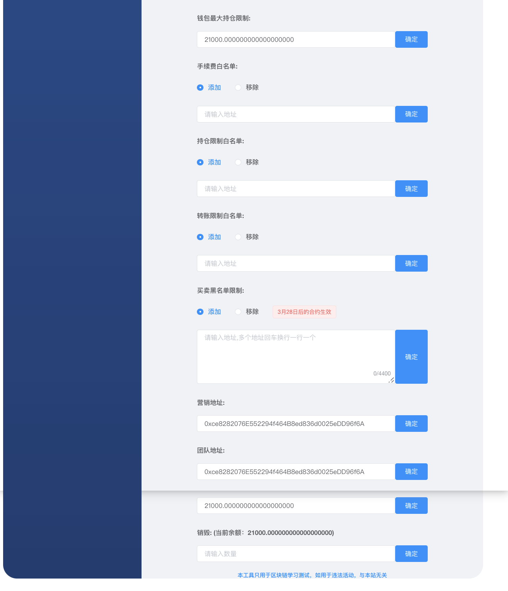

# 创建一个【双营销回流】代币

> **TokenTool是一个区块链工具箱，支持ETH、BSC、等超多公链，可以创建多种不同机制模型代币，轻松解决发币问题，可在几分钟内创建一个属于你自己的Token。**


> **点击加入 [TokenTool官方交流群](https://t.me/tokentool_app) 交流反馈**

> **推荐使用电脑版谷歌浏览器 + `Metamask` 插件钱包 进行操作.**
> **手机用户也可以在 `TP钱包`-发现-输入官网链接 进行操作.**


> **视频教程链接：[https://youtu.be/zPVY_oZH5qo](https://youtu.be/zPVY_oZH5qo)**


### 机制说明

```
税率分配主要包括:
营销,团队,回流,销毁

营销 : 扣除代币,'触发时'兑换BNB或USDT(取决于你加什么池子)->进营销钱包
团队 : 扣除代币,'触发时'兑换BNB或USDT(取决于你加什么池子)->进团队钱包（可以理解成第二个营销地址）
回流 : 扣除代币,'触发时'自动加池子->这部分管理员地址可撤池子
销毁 : 扣除代币,直接送进黑洞销毁
```


## 创建一个带有【双营销回流】代币

查看以下步骤，了解如何使用 MetaMask 通过 TokenTool 创建带有买卖费率令牌币。

1. 首先我们通过可视化界面创建代币，通过 [https://www.tokentool.info/createToken/v2](https://www.tokentool.info/createToken/v2) 打开创建代币功能.填写代币信息.


2. 参数介绍说明

**币种名称：** 代币的名称信息（如BitCoin）

**币种符号：** 代币的符号信息（如BTC）

**初始供应量：** 代币的总供应量（精度18位时，总供应量可以1后面15个0，精度17位时，总供应量可以1后面16个0，以此类推..）

**精度：** 代币的精度位数（精度是代表币的小数位数`如：0.000001`代表有6为精度）

**黑名单：** 黑名单限制买卖开关（开启后可在管理员页面进行操作添加某些地址无法进行`交易`,`转账`）

**自定义交易对：** 默认创建代币使用BNB交易对，通过自定义交易对开关，可输入 USDT、BUSD等合约地址来组合交易对信息


**交易平台：** 不同的链会有不同的交易平台（如ETH链有`uniswap`,BSC链有`pancakeSwap` 等）， **代币创建完成后需要在对应的交易平台添加流动性。**

**创建/拥有者：** 此代币的创建/拥有者，owner管理员，只有管理员才能进如管理员后台去修改手续费参数等操作

**团队地址：** 根据手续费比例分配给团队的地址的费用

**营销地址：** 根据手续费比例分配给营销的地址的费用（类似2个营销地址，如果没有，可以填写一样）

**买手续费：** 用户通过swap进行购买时收取的手续费费用（ **以下手续费为默认值，如果需要修改可进入管理员页面修改比例** ）

**卖手续费：** 用户通过swap进行卖出时收取的手续费费用（ **以下手续费为默认值，如果需要修改可进入管理员页面修改比例** ）

**回流比例分配：** （根据收取到的手续费进行二次分配）

​		**流动性：** 手续费占比添加到流动性中。

​		**营销：** 手续费占比兑换成BNB回流到营销地址中

​		**团队：** 手续费占比兑换成BNB回流到团队地址中

## Token管理员

查看以下步骤，了解如何使用 MetaMask 通过 TokenTool 进入Token管理员页面。


1. 管理员钱包链接MetaMask 钱包链接
2. 在Token管理员页面中输入代币的合约地址进入管理员页面


1. **拥有权转移：** 可以将来owner权限转移给第三者 或者 其他地址
2. **销毁权限：** 将owner地址转移给 `0x0000000000000000000000000000000000000000`地址

3. **买卖手续费：** 可编辑修改你的交易手续费（手续费在swap交易时收取，转账不会收取手续费）

4. **回流开关：** 用户在swap收取到的手续费将会存在当前合约中，达到了`最小回流数量` 触发回流机制
5. **最小回流数量：** 用户在swap收取到的手续费将会存在当前合约中，达到了`最小回流数量` 触发回流机制，会把合约中的本币兑换成BNB进行进入到团队，营销，流动性对应配置的手续费中
6. **回流比例：** 根据回流的比例，回流到各个位置
   1. 流动性代表进入池子中
   2. 营销代表转入营销地址
   3. 团队代表转入团队地址
7. **单次最大转账金额：** 限购/转账 限制（普通用户在买卖/转账时不可超过单次最大转账数量）



1. **钱包最大持仓限制：** 一个地址的数量不可超过（钱包最大持仓限制量）

2. **手续费白名单：** 可将固定地址添加到白名单中，使其在进行交易时免手续费，单次只能添加一个地址，可多次添加地址无上限

3. **持仓限制白名单：** 如设置了持仓限制将会对所有的地址进行限制钱包的最大数量，如要解除限制，将可加入白名单

4. **转账限制白名单：** 如设置了转账限制用户将在交易时受到限制，如加入白名单将不会收到限制

5. **黑名单限制：** 用户用户地址添加到黑名单中时，用户将无法 `转账` `交易` 操作 

6. **营销/团队地址：** 可二次编辑修改地址

7. **最大销毁数量：** 如币种在交易时有销毁机制，可设置销毁多大数量时不在进行销毁

8. **销毁金额：** 将您钱包中的余额转入到黑洞地址`0x000000000000000000000000000000000000dEaD`

9. **杀区块：** 自动杀区块,输入3代表杀3区块，意思就是前3区块(bsc大概9秒)买入的地址自动让代币转移到营销地址中。

10. **地址裂变：** 每笔交易都会自动向随机地址空投`一点点`代币,达到增加持币地址的效果


### 常见问题解答
- **我创建的代币可以在多个swap，比如 `博饼swap` `BabySwap` .. 加池子吗？**
  - 解答：创建代币的时候会有平台选择，如你选择了什么swap，比如你选择的是 `博饼swap` ，就要在`博饼swap` 添加池子。
- **代码是自动开源的吗?**
  - 解答：是的,在区块浏览器设施完善的链上都是自动开源的,包括`ETH` `BSC` `ARB`…等等
- **营销/团队地址进的是代币还是USDT?**
  - 解答：营销钱包进的是取决于你的交易对，,创建代币默认使用本链币 如（BSC链默认是用BNB加池子）营销进的就是BNB，如果自定义交易对使用`USDT`，那么营销进的就是USDT。
- **我在创建代币的时候，忘记打开黑名单开关，我还能用黑名单功能吗？**
  - 解答：不可以，如果你没打开黑名单功能，合约代码中将不会存在黑名单逻辑代码，检测合约机器人也将也不会检测到黑名单开关。 
- **上文说的 触发机制 是什么意思？**
  - 解答：非白名单地址在买卖时，收取的税会存放到合约地址中，有 **卖出操作** ,就会触发营销,回流，分红等机制
- **回流自动加池子的这部分LP到哪去了呢？**
  - 解答：回流到池子后产生的`LP`自动发放到`管理员钱包`。
- **我可以使用我的母币作为我的交易对吗？**
  - 解答：可以，在创建代币的时候，打开自定义交易对开关，输入你的母币合约就可以，在添加流动性时就可以使用你的母币来添加池子。
- **我自定义USDT交易对，可以用BNB加池子吗？**
  - 解答：不可以，自定义什么交易对就加什么交易对，如果没有自定义就是默认BNB交易对。


> 引用地址

> 创建代币地址：[https://www.tokentool.info/createToken/v2](https://www.tokentool.info/createToken/v2) 

> YouTube教学视频：[https://youtu.be/zPVY_oZH5qo](https://youtu.be/zPVY_oZH5qo)  
