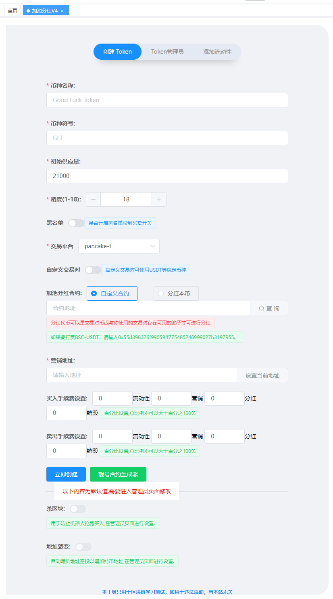
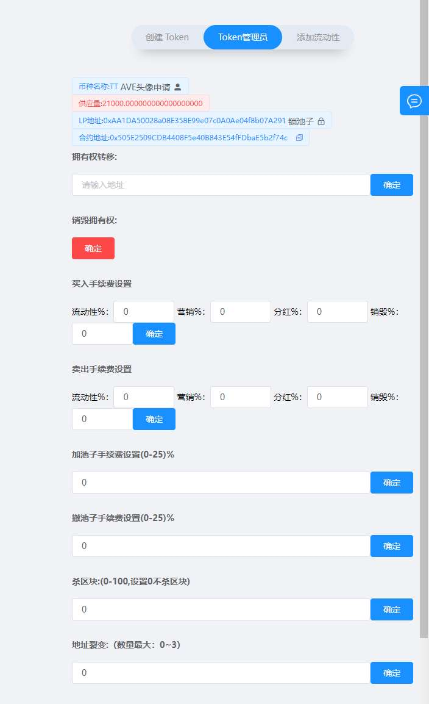
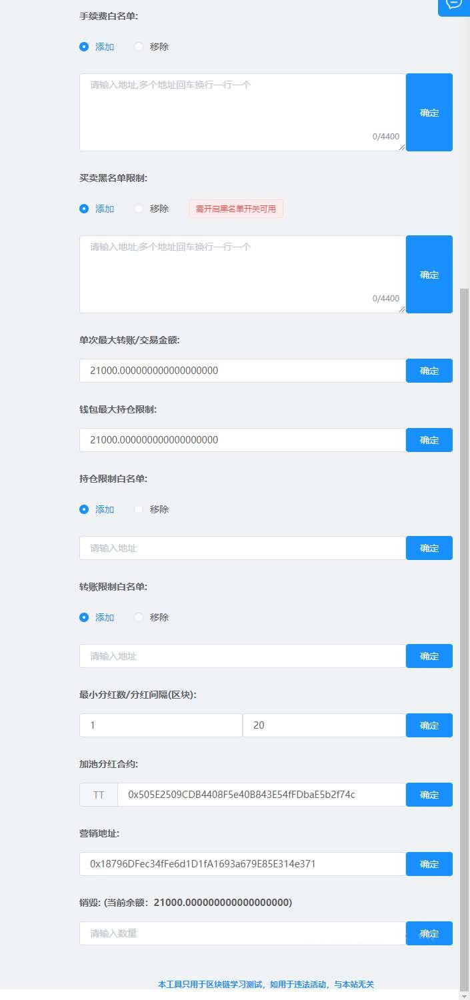

# 创建一个【加池分红】代币

> **TokenTool是一个区块链工具箱，支持ETH、BSC、等超多公链，可以创建多种不同机制模型代币，轻松解决发币问题，可在几分钟内创建一个属于你自己的Token。**


> **点击加入 [TokenTool官方交流群](https://t.me/tokentool_app) 交流反馈**

> **推荐使用电脑版谷歌浏览器 + `Metamask` 插件钱包 进行操作.**
> **手机用户也可以在 `TP钱包`-发现-输入官网链接 进行操作.**


### 机制说明

```
税率分配主要包括:
营销,回流,销毁,加池子分红

营销 : 扣除代币,'触发时'兑换底池币->进营销钱包
回流 : 扣除代币,'触发时'自动加池子->这部分管理员地址可撤池子
销毁 : 扣除代币,直接送进黑洞销毁
加池子分红 : 扣除代币,'触发时'兑换分红币分给加池子用户
```


查看以下步骤，了解如何使用PC电脑端的Matamask钱包通过TokenTool创建持币分红代币。

1. MateMask钱包链接到区块链网络。
2. 打开创建代币链接地址 [https://tokentool.info/createToken/v4](https://tokentool.info/createToken/v4)
3. 输入必要的信息，在此之前，让我们回顾一下所有需要填写的重要字段：





**币种名称：** 代币的名称信息（如BitCoin）

**币种符号：** 代币的符号信息（如BTC）

**初始供应量：** 代币的总供应量

**精度：** 代币的精度位数（精度是代表币的小数位数`如：0.000001`代表有6为精度）

**黑名单：** 黑名单限制买卖开关（开启后可在管理员页面进行操作添加某些地址无法进行`交易`,`转账`）

**交易平台：** 不同的链会有不同的交易平台（如ETH链有`uniswap`,BSC链有`pancakeSwap` 等）， **代币创建完成后需要在对应的交易平台添加流动性。**

**自定义交易对：** 默认创建代币使用BNB交易对，通过自定义交易对开关，可输入 USDT、BUSD等合约地址来组合交易对信息

**加池分红合约：** 给予加池子的地址奖励合约，可以使用`USDT`、`DOGE`、`SHIB`等主流币，或者也可以使用本币分红。


**营销钱包：** `营销税`部分的代币将会兑换成底池币`BNB`或者`USDT`（取决于你的池子交易对）发送到该地址。

**流动性 (%)：** 每笔交易都会扣除对应比例代币送进`合约地址`,在 **触发机制** 时会自动加池子,使池子更厚。

**营销 (%)：** 每笔交易都会扣除对应比例代币送进`合约地址`,在 **触发机制** 时会自动兑换成底池币(这取决于你使用什么底池,营销就进什么币) 发送到你的营销钱包地址

**分红 (%)：** 每笔交易都会扣除对应比例代币送进`合约地址`,在 **触发机制** 时会自动兑换成`USDT`(取决于你选择的分红代币)发放给添加池子的用户地址

**销毁(%)：** 每笔交易中会根据比例数量进行销毁基础代币，转入到`0x000000000000000000000000000000000000dead` 黑洞地址


## Token管理员介绍

当前拥有者(owner)在没有放弃权限时，可通过token管理员页面进入后台，对其参数等信息进行可视化修改。我们提供了友好的交互页面，让管理者更加方便的操作合约/修改参数。




1. **币种全称 :** 代币全称
2. **LP地址 : ** 显示池子LP的合约地址，可点击`锁池子` 按钮跳转锁池子页面
3. **合约地址 : ** 显示当前代币合约地址
4. **拥有权转移：** 可以将来owner权限转移给第三者 或者 其他地址
5. **销毁权限：** 将owner地址转移给 `0x0000000000000000000000000000000000000000`地址
6. **买卖手续费：** 可编辑修改你的交易手续费（手续费在swap交易时收取，转账不会收取手续费）
7. **加池子手续费：** 用户在添加池子时收取的手续费（着一部分手续费收取属于`分红` ）
8. **撤池子手续费：** 用户在撤池子时收取的手续费（着一部分手续费收取属于`分红` ）
9. **杀区块：** 自动杀区块,输入3代表杀3区块，意思就是前3区块(bsc大概9秒)买入的地址自动让代币转移到营销地址中。
10. **地址裂变：** 每笔交易都会自动向随机地址空投`一点点`代币,达到增加持币地址的效果




7. **手续费白名单：** 添加为白名单的地址，在交易时将不会产生税费。地址批量添加多个地址，一行一个地址。可根据添加和移除控制。

8. **买卖黑名单限制：** 添加为黑名单的地址将会无法【转账】/【交易】/【买卖】，可根据添加和移除控制。

9. **单次最大转账金额：** 限购/转账 限制（普通用户在买卖/转账时不可超过单次最大转账数量）

10. **钱包最大持仓限制：** 一个地址的数量不可超过（钱包最大持仓限制量）

11. **持仓限制白名单：** 如设置了持仓限制将会对所有的地址进行限制钱包的最大数量，如要解除限制，将可加入白名单

12. **转账/买卖限制白名单：** 如设置了转账限制用户将在交易时受到限制，如加入白名单将不会收到限制

13. **最小分红/分红间隔：** 

    1. **最小分红：** 指分红池中的余额大于多少时才开始分红，比如（分红`USDT`，最小数量填写10，在合约地址中的USDT达到10U之后才开始分红）。
    2. **分红间隔：** 上次排队分红后，间隔多长时间开始进行下一轮分红。
    3. **温馨提示：可以修改最小数量和分红间隔，可提高分红速度。**

14. **加池分红合约：** 可以进行修改分红合约，修改分红合约地址需要注意分红合约条件，可查看以下常见问题解答。

15. **营销地址：** 可以二次修改地址，底池使用什么交易对进营销也是什么币。

16. **销毁：** 销毁将币的数量进行销毁转入黑洞地址，转入到`0x000000000000000000000000000000000000dead` 地址。

    


### 常见问题解答

- **分红都可以分红什么币？**
  - 解答：可以分红本币和其他币，本币没有任何条件。
  - 其他币：主要是根据你的底池交易对有关，比如你使用的是`USDT`作为交易对池子，你可以直接分红交易对币 **`USDT`**  和 **跟USDT有交易对的币** 如`BTC`、`DOGE`、`SHIB` 等主流币。

- **我可以分红BNB吗？**
  - 解答：可以，你可以使用`BNB`交易对，分红合约可以是`WBNB` **（直接分红交易对币WBNB）**。
  - 或者你可以使用`USDT`交易对，分红合约也可以是`WBNB` **（WBNB跟USDT有交易对的币）**

- **加池子设置0%，为什么用户加池子的时候还收取税？**
  - 解答：在swap页面加池子时 **必须要交易对在上面如（USDT）**，当前币在下面进行加池子。
  - 如果是BNB交易对，**用户先要把BNB 1:1 兑换成WBNB**，然后在加池子，WBNB在上面，当前币在下面进行加池子。
- **上面描述中提到的分红池是什么概念？**
  - 解答：非白名单地址买卖时，会收取手续费，手续费在卖时会 **触发兑换机制** ，比如分红 **`USDT`**，分红部分的税根据分红合约兑换后进入合约地址中，合约地址中的`USDT` 大于 **`最小分红数`** 并且上一次分红和本次分红间隔区块满足时，触发分红机制，开始给添加池子地址进行分红。
- **分红是一次性给所有添加池子者分红的吗？**
  - 解答：不是，排队分红，每次触发分红（达到上述条件）时会进行7～10地址左右进行排队分红，分红到最后一位地址时，又会开始从第一个地址循环。
- **我创建的代币可以在多个swap，比如 `博饼swap` `BabySwap` .. 加池子吗？**
  - 解答：创建代币的时候会有平台选择，你选择了什么swap，（比如你选择的是 `博饼swap` ），就要在`博饼swap` 添加池子。


- **我创建的加池分红机制的代币，可以用`USDT`，`BUSD` 或`自己的子币` 加池子吗?**
  - 解答：根据你创建时使用的交易对，如没有自定义默认使用的是链本币 BSC链是 `BNB`, 以太坊是`ETH`币 ，自定义交易对是什么币添加池子也是要使用自定义时的币进行加池子。

- **代码是自动开源的吗?**
  - 解答：是的,在区块浏览器设施完善的链上都是自动开源的,包括`ETH` `BSC` `ARB`…等等

- **营销进的是代币还是USDT?**
  - 解答：营销钱包进的取决于你的交易对，你创建的是默认交易对就是BNB，自定义交易对就是自定义时的币，例如（自定义`USDT`等）。

- **我在创建代币的时候，忘记打开黑名单开关，我还能用黑名单功能吗？**
  - 解答：不可以，如果你没打开黑名单功能，合约代码中将不会存在黑名单逻辑代码，检测合约机器人也将也不会检测到黑名单开关。 

- **上文说的 触发机制 是什么意思？**
  - 解答：非白名单地址在买卖时，收取的税会存放到合约地址中，有 **卖出操作** ,就会触发营销,回流，分红等机制

- **我在BSC链上，可以创建分红XX币，或者我自己创建的子币吗？**
  - 解答：只要你的XX币有BNB的交易对存，就可以分红，主流币大部分都有BNB交易对，如`USDT` 、`BUSD` 、 `BTC` 、 `ETH ` 等等。

- **回流自动加池子的这部分LP到哪去了呢？**
  - 解答：回流到池子后产生的`LP`自动发放到`营销钱包`。
- **为什么我用批量转账工具把LP发放给散户之后,他们没有收到分红?**

  - 解答：直接转账LP的形式不会将接收LP的地址列入到分红列表当中,直接`接收LP转账`而不是通过`加池子`操作获取LP的地址需要自行`卖一笔`或者`再加一次池子`才能享受LP分红


