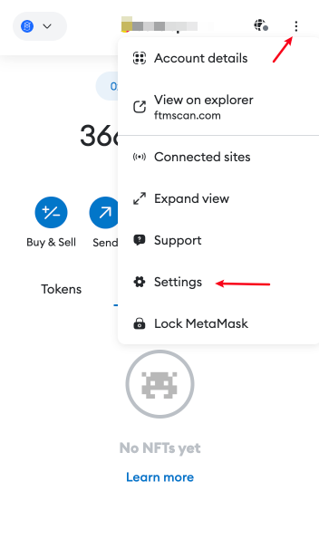
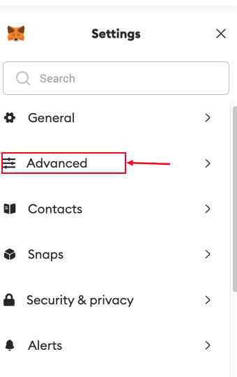

# 加速交易

**交易被卡住或待处理？以下是如何加速它，让矿工尽快打包。**

随着天然气(Gas)汽油价格飙升，您有时可能会需要很长时间才能确认交易。这可能很烦人，因为它会阻止钱包进行更多交易，直到交易清除为止。

### MetaMask钱包打开自定义Nonce

#### 1. 进入设置 -> 高级

#### 2.开启自定义交易

#### 3.找到要加速的交易记录
1. 在 Metamask 中找到卡住的交易。可通过[区块链浏览器](https://etherscan.io/)输入钱包地址查询等待打包的交易Hash.
2. 输入交易Hash记录后，会显示交易信息，需要注意Nonce随机数值。
3. 点击交易加速，在MetaMask钱包中需要注意自定义Nonce随机数填写和网页中显示的Nonce随机数一致。

将随机数更改为步骤 3 中的随机数，然后单击发送。

您的交易应该很快就会清算，如果交易还未被发现，则需要通过【手动模式】调高GasPrice后重复以上步骤

> 引用地址：[https://tokentool.info/other/transaction/speed](https://tokentool.info/other/transaction/speed)
>
> 最新Gas汽油：[https://tokentool.info/gasPrice/eth](https://tokentool.info/gasPrice/eth)
>
> 原文链接：[https://docs.cointool.app](https://docs.cointool.app)

